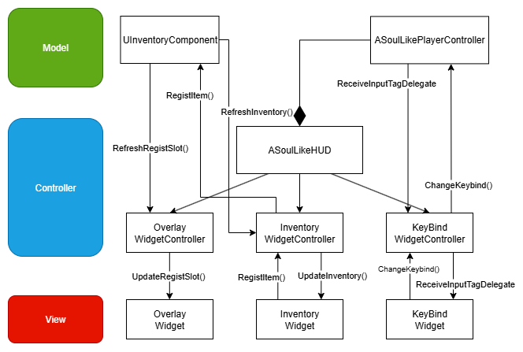
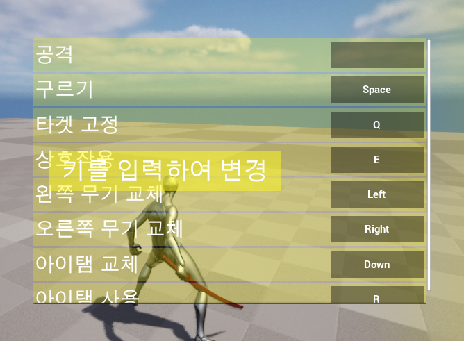
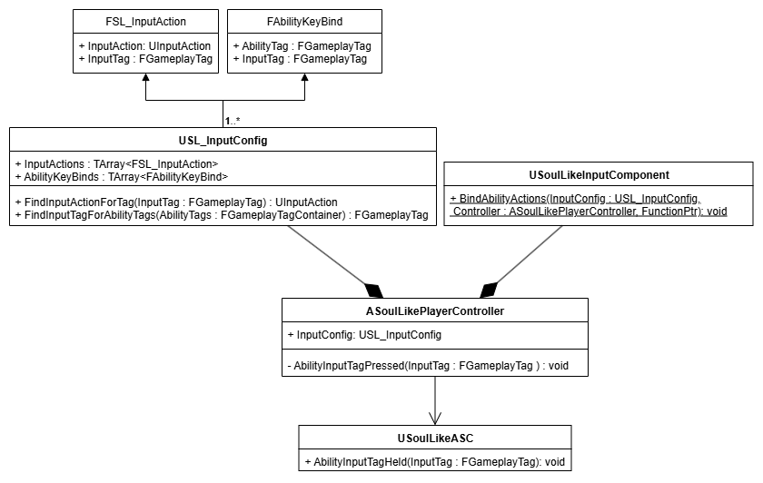
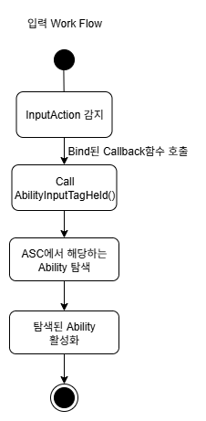
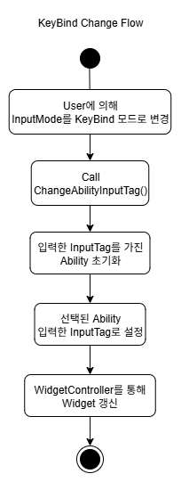
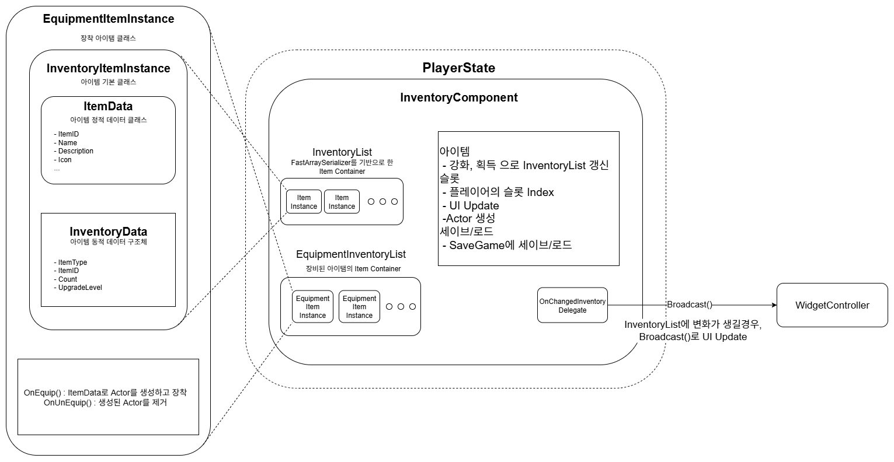
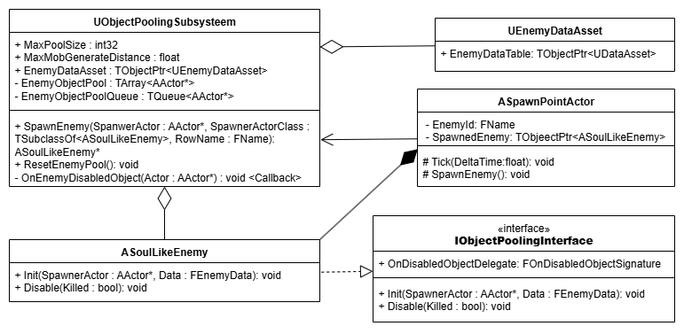
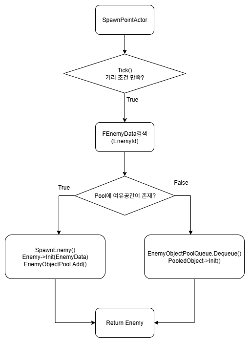

## SoulLike Action RPG
Unreal Engine 5 Portfolio
- Unreal Engine 5 버전 : 5.4.4
- 에디터 : VSCode, Rider
- 제작기간 : 2025.03~2025.06 (4개월)
- 개발 인원 : 1인개발
## 프로젝트 개요
매인사진        
소울라이크 액션을 레퍼런스로 액션 RPG     
GAS 기반의 전투 시스템, 커스터마이징 가능한 키 바인딩, FastArray 기반 인벤토리, MVC 구조의 UI 연동, ObjectPooling 적 리스폰 등을 구현
## CharacterBase 구조

## MVC 패턴
    
Widget과 클래스를 분리하여 의존성을 줄이고 재사용성을 높이기 위해 MVC패턴으로 UI를 구현
1. 로컬 클라이언트에 하나만 존재하는 Controller의 HUD에 WidgetController를 생성
2. 현재 클라이언트가 조종하는 Controller는 싱글톤처럼 한개의 객체만 존재하고 HUD또한 한개만 존재
3. UBlueprintFunctionLibrary를 재정의 한 Static Helper Function을 사용해서 HUD의 WidgetController를 사용

WidgetController와 Widget, Model들과 WidgetController는 Delegate를 통해 통신     
단방향으로 작동하며 View와 Model간의 의존성을 최소화
## KeyBind
      
Input을 대기하는 상태(InputMode_KeyBind)

EnhancedInput의 InputAction 기반 구조를 확장하여, GameplayTag 기반으로 Ability를 동적으로 연결할 수 있도록 설계        
EnhancedInput의 InputAction을 GameplayTag(InputTag)와 매핑       
InputTag를 캐릭터의 어빌리티에 매핑해서 Ability의 TriggerInput을 동적으로 전환할 수 있도록 구현      
      
InputTag로 입력을 구분하고 Ability를 활성화   
      
InputAction과 Ability는 InputTag로 매핑되어 있으므로, Ability의 InputTag를 변경한다면, 매칭된 InputAction 변경 가능
```c++
//SoulLikePlayerController.cpp
void ASoulLikePlayerController::AbilityInputTagPressed(FGameplayTag InputTag)
{
   ...
        //위 사진과 같이 키 입력을 대기하고있는 InputMode_KeyBind 일 경우, 입력된 InputTag로 선택된 Ability의 InputTag 설정
	if(InputMode.MatchesTagExact(FSoulLikeGameplayTags::Get().InputMode_KeyBind))
	{
		ChangeAbilityInputTag(InputTag);
		return;
	}
	
	if(GetASC())
	{
		GetASC()->AbilityInputTagPressed(InputTag);
	}
}

void ASoulLikePlayerController::ChangeAbilityInputTag(const FGameplayTag& InputTag)
{
	if(UKeybindMenuWidgetController* KeybindMenuWidgetController = USoulLikeFunctionLibrary::GetKeybindMenuWidgetController(this))
	{
		if(GetASC())
		{
			GetASC()->ChangeAbilityInputTag(KeybindMenuWidgetController, InputTag);
		}
	}
}
```
```c++
//SoulLikeAbilitySystemComponent.cpp
void USoulLikeAbilitySystemComponent::ChangeAbilityInputTag(UKeybindMenuWidgetController* KeybindMenuWidgetController, const FGameplayTag& InputTag)
{
	UAbilityInfo* AbilityInfo = USoulLikeFunctionLibrary::GetAbilityInfo(this);
	if(AbilityInfo == nullptr) return;

	if(KeybindMenuWidgetController == nullptr) return;

	const FGameplayTag SelectedAbilityTag = KeybindMenuWidgetController->SelectedAbilityTag;
        //변경할 InputTag를 가지고 있는 어빌리티는 초기화
	if(FGameplayAbilitySpec* PrevAbilitySpec = GetSpecFromInputTag(InputTag))
	{
		const FGameplayTag& PrevAbilityTag = GetAbilityTagFromSpec(*PrevAbilitySpec);
		
		PrevAbilitySpec->DynamicAbilityTags.RemoveTag(InputTag);
		
		AbilityInfo->ChangeAbilityInputTag(PrevAbilityTag, FGameplayTag());

		MarkAbilitySpecDirty(*PrevAbilitySpec);
		
		KeybindMenuWidgetController->OnReceiveInputTagDelegate.Broadcast(PrevAbilityTag);
	}
        //변경할 어빌리티 태그에 InputTag추가
	if(FGameplayAbilitySpec* AbilitySpec = GetSpecFromAbilityTag(SelectedAbilityTag))
	{
		AbilitySpec->DynamicAbilityTags.RemoveTag(AbilityInfo->GetAbilityInputTag(SelectedAbilityTag));
		
		AbilityInfo->ChangeAbilityInputTag(SelectedAbilityTag, InputTag);

		AbilitySpec->DynamicAbilityTags.AddTag(InputTag);

		MarkAbilitySpecDirty(*AbilitySpec);
		
            //Widget을 Delegate를 통해 갱신
		KeybindMenuWidgetController->SelectedAbilityTag = FGameplayTag();
		KeybindMenuWidgetController->OnReceiveInputTagDelegate.Broadcast(SelectedAbilityTag);
	}
}
```
## InventorySystem

멀티플레이를 고려하여 Item들의 리플리케이션을 최소화 하기 위해 Inventory를 FastArraySerializer를 사용         
Item의 내부 데이터는 ItemInstance에 UItemData와 FInventoryData에서 보관      
1. UItemData : 아이템의 정적 정보
2. FInventoryData : 아이템의 동적 정보

Struct는 UObject를 상속받지 않았기 때문에 Cast<>를 사용할 수 없다. 또한, Blueprint에서 Cast 노드를 사용할 수 없다.      
따라서 FSL_ItemData를 UObject화 해서 저장
1. ItemInstance를 생성할 때 FindItemDataFromIndexAndItemType() 팩토리 함수 사용        
2. ItemID와 GameplayTag로 FSL_ItemData를 탐색       
3. 탐색한 FSL_ItemData로 UItemData를 생성, 생성한 ItemData를 ItemInstance에 저장     
```c++
UItemData* UItemDataAsset::FindItemDataFromIndexAndItemType(UObject* Outer, FGameplayTag ItemType, FName ItemID) const
{
	const FSoulLikeGameplayTags& GameplayTags = FSoulLikeGameplayTags::Get();
	
	for(const FItemDataTable& ItemDataTableStruct : ItemDataTables)
	{
		if(ItemType.MatchesTagExact(ItemDataTableStruct.ItemTypeTag))
		{
			FSL_ItemData* ItemData = ItemDataTableStruct.DataTable->FindRow<FSL_ItemData>(ItemID, FString("Not Found"));
			if(ItemData == nullptr) return nullptr;

			if(Outer)
			{
				UItemData* ItemDataObject = NewObject<UItemData>(Outer, ItemDataTableStruct.ItemDataClass.Get());
				ItemDataObject->Init(ItemData);

				return ItemDataObject;
			}
		
		}
	}
	
	return nullptr;
}
```
### ObjectPoolingSubsystem
     
Enemy의 ObjectPoolingSubsystem 구조        
     
EnemySpawn Workflow     
Tick()은 1초에 1번 호출되도록 빈도 조절  
ASoulLikeEnemy는 Disable됬다면 Bind 해둔 OnEnemyDisabledObject()를 호출해서 ObjectPoolQueue에 대기시키고,        
다시 Spawn해야할 때 활성화
```c++
ASoulLikeEnemy* UObjectPoolingSubsystem::SpawnEnemy(AActor* SpawnerActor, const TSubclassOf<ASoulLikeEnemy>& SpawnActorClass, FName RowName)
{
	FScopeLock Lock(&PoolLock);
	
	if(SpawnerActor == nullptr) return nullptr;
	if(!SpawnActorClass->IsValidLowLevel()) return nullptr;
	
	FEnemyData* Data = EnemyDataAssset->EnemyDataTable->FindRow<FEnemyData>(RowName, FString(""), false);
	if(Data == nullptr) return nullptr;
	
 	if(EnemyObjectPool.Num() < MaxPoolSize)
	{
		FTransform SpawnTransform = SpawnerActor->GetTransform();
		
		if(UWorld* World = SpawnerActor->GetWorld())
		{
			ASoulLikeEnemy* EnemyActor = World->SpawnActorDeferred<ASoulLikeEnemy>(Data->EnemyClass, SpawnTransform, SpawnerActor);
			if(IObjectPoolingInterface* Interface = Cast<IObjectPoolingInterface>(EnemyActor))
			{
				if(Data != nullptr)
				{
					EnemyActor->Init(SpawnerActor, *Data);
				}
				EnemyActor->OnDisabledObjectDelegate.AddDynamic(this, &UObjectPoolingSubsystem::OnEnemyDisabledObject);
				EnemyActor->SpawnDefaultController();
				EnemyActor->FinishSpawning(SpawnTransform);
			
				EnemyObjectPool.Add(EnemyActor);
				return EnemyActor;
			}
		}
	}
	else
	{
 		if(!EnemyObjectPoolQueue.IsEmpty())
		{
			AActor* PooledObject  = nullptr;
			if(EnemyObjectPoolQueue.Dequeue(PooledObject))
			{
				if(ASoulLikeEnemy* EnemyActor = Cast<ASoulLikeEnemy>(PooledObject))
				{
					EnemyActor->SetActorTransform(SpawnerActor->GetTransform(), false,  nullptr, ETeleportType::ResetPhysics);
					if(Data != nullptr)
					{
						EnemyActor->Init(SpawnerActor, *Data);
					}
					EnemyActor->SpawnDefaultController();
					return EnemyActor;
				}
			}
		}
	}
	return nullptr;
}
```
여러개의 오브젝트가 동시에 하나의 Subsystem의 객체에 접근, 관여할 수 있기때문에
ScopeLock을 통해 RaceCondition을 차단
```c++
FScopeLock Lock(&PoolLock);
```

### MeleeTrace
### ComboAbility의 State로 인한 FSM
### GAS


