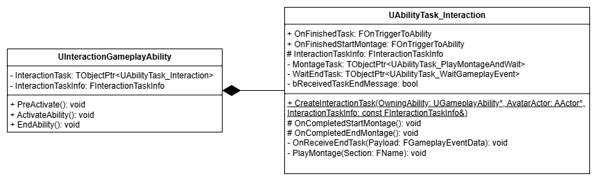

# SoulLike Action RPG


# 목차
1. [프로젝트 개요](#프로젝트-개요)
2. [InventorySystem](#InventorySystem)
3. [UI](#UI)
4. [KeyBind](#keybind)
5. [ObjectPoolingSubsystem](#ObjectPoolingSubsystem)
6. [GameplayAbilitySystem](#gameplayabilitysystem)       
    6.1 [FSoulLikeGameplayTags](#FSoulLikeGameplayTags)              
    6.2 [AbilityState](#AbilityState)       
    6.3 [AttackMontage](#AttackMontage)               
    6.4 [TargetLock](#TargetLock)              
    6.5 [InteractionAbility](#InteractionAbility)
7. [플레이 영상](#플레이-영상)

## 프로젝트 개요
Unreal Engine 5 Portfolio
- Unreal Engine 5 버전 : 5.4.4
- 에디터 : VSCode, Rider
- 개발 인원 : 1인개발

소울라이크 액션을 레퍼런스로 한 액션 RPG     
GAS 기반의 전투 시스템, 동적 키 바인딩, FastArray 기반 인벤토리, MVC 구조의 UI 연동, ObjectPooling 적 리스폰 등을 구현
## InventorySystem
     

각 캐릭터에 `UInventoryComponent`를 통해 **InventorySystem**을 구현한다.      
플레이어는 **PlayerState**, 적은 **Character** 클래스에 `UInventoryComponent`를 소유한다.     
캐릭터가 소지하고 장착하는 모든 로직을 `UInventoryComponent`에서 관리한다.        
`UInventoryWidgetController`를 통해 **Widget**과 상호작용 할 수 있다.

        

**ItemInstance**는 아이템의 데이터를 모아서 개념을 담당하는 `UObject`입니다.        
3가지로 구분되어 관리됩니다.
1. **InventoryData**        
    * 인벤토리에서 아이템의 데이터를 저장하는 구조체
    * 아이템의 변화에 따라 동적으로 변화
    * 리플리케이션 됨
2. **ItemData**
    * 변하지 않는 아이템 데이터를 저장하고 있는 UObject
    * 언리얼 리플렉션의 **RTTI**를 사용하기 위해 `FTableRow` 구조체를 `UObject`로 변환해서 사용
3. **ItemActor**
    * 아이템이 월드에 존재할 때만 사용
    * 해당 클래스를 상속받은 액터를 통해 기능 추가

중복적인 `UItemData` 생성을 막기 위해 `UItemDataAsset` 데이터애셋 객체에서 관리     

### 구현 코드

#### ItemDataAsset.cpp
<details>
    <summary>코드 보기</summary>

```c++
//ItemDataTable을 저장하는 구조체. 해당 DataTable에 맞는 UItemData의 Class를 저장
USTRUCT(BlueprintType)
struct FItemDataTable
{
    GENERATED_BODY()
    
    UPROPERTY(EditDefaultsOnly, BlueprintReadOnly)
    TObjectPtr<UDataTable> DataTable;
    
    UPROPERTY(EditDefaultsOnly, BlueprintReadOnly)
    FGameplayTag ItemTypeTag = FGameplayTag();
    
    UPROPERTY(EditDefaultsOnly, BlueprintReadOnly)
    TSubclassOf<UItemData> ItemDataClass;
};

...
//FSL_ItemData의 하위구조체를 기반으로 UItemData를 생성하고 초기화 해주는 함수
UItemData* UItemDataAsset::FindItemDataFromIndexAndItemType(const UObject* Outer, const FGameplayTag& ItemType, const FName& ItemID)
{
    for(const FItemDataTable& ItemDataTableStruct : ItemDataTables)
    {
        if(ItemType.MatchesTagExact(ItemDataTableStruct.ItemTypeTag))
        {
            FSL_ItemData* ItemData = ItemDataTableStruct.DataTable->FindRow<FSL_ItemData>(ItemID, FString("Not Found"));
            if(ItemData == nullptr) return nullptr;
    
            if (Outer && ItemDataTableStruct.ItemDataClass != nullptr)
            {
                //저장해 둔 TMap에 ItemID를 통해 UItemData재활용
                if (TObjectPtr<UItemData>* FoundItemPtr = ItemDataToItemID.Find(ItemData->ItemID))
                {
                    if (IsValid(*FoundItemPtr))
                    {
                        return *FoundItemPtr;
                    }
                    ItemDataToItemID.Remove(ItemData->ItemID);
                }
                
                UItemData* ItemDataObject = NewObject<UItemData>(const_cast<UObject*>(Outer), ItemDataTableStruct.ItemDataClass.Get());
                ItemDataObject->Init(ItemData);
                
                //TMap에 저장해서 UItemData재활용
                ItemDataToItemID.Add(ItemData->ItemID, ItemDataObject);
    
                return ItemDataObject;
            }
        
        }
    }
    
    return nullptr;
}
```
</details>      

### 아이템 데이터를 UObject화 하는 이유
언리얼 엔진의 DataTable은 기본적으로 **FStruct**(`FTableRowBase`) 구조를 사용한다.       
하지만 해당 프로젝트에서는 FStruct를 **UObject**(`UItemData`)로 변환하는 구조로 구현했다.

* 리플렉션 시스템과 RTTI의 한계 극복     
    - 문제점: `FStruct`는 리플렉션 시스템`UStruct`에 등록되지만, UClass 기반이 아니기 때문에 RTTI(RunTime Type Information)를 완벽하게 지원하지 않음.
    - 발생 문제: 언리얼 엔진의 핵심 기능인 `Cast<T>`을 사용할 수 없으며, 또한 블루프린트의 Cast 노드를 사용할 수 없음


* 다형성(Polymorphism) 및 확장성 확보
  - 해결책: 정적 데이터(`FStruct`)를 `UObject` 기반의 클래스(`UItemData`, `UWeaponData` 등)로 래핑하여 관리
  - 이점: 
    1. 안전한 캐스팅: `Cast<UWeaponData>(ItemData)`와 같은 엔진 표준 캐스팅 기능을 C++와 블루프린트 모두에서 사용 가능.
    2. 상속 구조 활용: 아이템 타입(무기, 방어구, 소모품)에 따른 데이터 계층 구조 설계 및 확장 용이.
    3. 블루프린트 호환성: `UObject`의 메모리 관리(GC) 및 리플렉션 기능을 활용하여 블루프린트에서 사용 용이.


* **DataTable**에 저장된 `FSL_ItemData`를 `UItemData`로 변환 과정
  1. **ItemInstance를** 생성할 때 `FindItemDataFromIndexAndItemType()` 팩토리 함수 사용
  2. **ItemID**와 **ItemTag**로 `FSL_ItemData`를 탐색
  3. 탐색한 `FSL_ItemData`로 `UItemData`를 생성, 생성한 **ItemData**를 **ItemInstance**에 저장

### 구현 코드

#### SoulLikeItemTypes.h
<details>
    <summary>코드 보기</summary>

```c++
UCLASS(BlueprintType)
class UWeaponData : public UEquipmentData
{
    GENERATED_BODY()

public:
    
    virtual void Init(const FSL_ItemData* ItemData) override
    {
        Super::Init(ItemData);
        const FSL_WeaponData* WeaponData = static_cast<const FSL_WeaponData*>(ItemData);

        if(WeaponData == nullptr) return;
	    
        ...
    }
}
```
</details>

## UI
       
UI와 게임간의 상호작용 구현을 위해 MVC패턴을 채용      
각 기능의 Widget에 따라 WidgetController를 생성해 관리

### WidgetController        
- 게임 로직과 UI 사이를 중계해 주는 Controller
- Model은 Widget을 대상으로 명령을 내리지 않고 Broadcast를 통해 동시에 Widget에 메세지를 보냄
- Widget에서 WidgetController를 통해 Model의 Logic을 실행
- 싱글톤 패턴으로 구현

WidgetController는 AHUD에서 생성하고 관리.       
UBlueprintFunctionLibrary를 재정의 한 Static Helper Function을 사용해서 생성하거나 사용 가능

### 구현 코드

#### SoulLikeFunctionLibrary.cpp
<details>
    <summary>코드 보기</summary>

```c++
//WidgetController를 초기화 하기 위한 FWidgetControllerParams 생성 함수
bool USoulLikeFunctionLibrary::MakeWidgetControllerParams(const UObject* WorldContextObject,
                                                          ASoulLikeHUD*& OutSoulLikeHUD, FWidgetControllerParams& OutWCParams)
{
	APlayerController* PC = UGameplayStatics::GetPlayerController(WorldContextObject, 0);
	if(PC == nullptr) return false;
	
	OutSoulLikeHUD = Cast<ASoulLikeHUD>(PC->GetHUD());
	if(OutSoulLikeHUD == nullptr) return false;

	ASoulLikePlayerState* PS = PC->GetPlayerState<ASoulLikePlayerState>();
	if(PS == nullptr) return false;

	UAbilitySystemComponent* ASC = PS->GetAbilitySystemComponent();
	UAttributeSet* AS = PS->GetAttributeSet();
	OutWCParams.PlayerController = PC;
	OutWCParams.PlayerState = PS;
	OutWCParams.AbilitySystemComponent = ASC;
	OutWCParams.AttributeSet = AS;
	
	return true;
}

UInventoryWidgetController* USoulLikeFunctionLibrary::GetInventoryWidgetController(const UObject* WorldContextObject)
{
    FWidgetControllerParams Params;
    ASoulLikeHUD* SoulLikeHUD;
    const bool bSuccessfulMakingParams = MakeWidgetControllerParams(WorldContextObject, SoulLikeHUD, Params);
    if(bSuccessfulMakingParams)
    {
        return SoulLikeHUD->GetInventoryWidgetController(Params);
    }
    return nullptr;
}
```
</details>

#### SoulLikeHUD.cpp
<details>
    <summary>코드 보기</summary>

```c++
UInventoryWidgetController* ASoulLikeHUD::GetInventoryWidgetController(const FWidgetControllerParams& WCParams)
{
    if(InventoryWidgetController == nullptr){
    
        InventoryWidgetController = NewObject<UInventoryWidgetController>(this, InventoryWidgetControllerClass);
        InventoryWidgetController->SetWidgetControllerParams(WCParams);
        InventoryWidgetController->BindCallbacksToModels();
    }
    return InventoryWidgetController;
}
```
</details>

### WidgetController 상호작용 시퀀스

>     
> 장착 시, MVC 상호작용 시퀀스

결합도를 낮추고 코드의 재사용성을 높이기 위해 MVC 패턴을 기반으로 한 단방향 데이터 흐름 구조를 설계      
Model(InventoryComponent)과 View(Widget)는 서로를 전혀 모르며, WidgetController를 통해 소통   
- 데이터 흐름 (Data Flow)
   - Input (Control): View → Controller → Model
   - 유저 입력은 **함수 호출(Function Call)**을 통해 명확한 명령으로 전달됩니다.<br/>
     Ex) 아이템 장착 요청 (RequestEquip), 스탯 포인트 투자
   - Output (Update): Model → Controller → View
   - 데이터 변경은 Delegate(Broadcast)를 통해 전파<br/>
     Ex) 인벤토리 슬롯 변경, 스탯 값 변화 등.

이로 인해 InventoryComponent와 Widget은 서로의 존재를 몰라도 상호작용이 가능      
또한 Widget과 InventoryComponent가 변경 되더라도 서로 의존성을 분리 했기 때문에 코드를 추가적으로 수정할 필요가 없음

## KeyBind

>      
Input을 대기하는 상태(InputMode_KeyBind)

      

EnhancedInput과 GameplayTag를 결합하여, 하드코딩 없는 유연한 입력 시스템 구현          
플레이어의 입력을 InputTag(FGameplayTag)로 정의해서, Ability에 대한 입력을 InputTag를 통해 동적으로 할당할 수 있도록 구현 

### 입력 파이프라인
입력별로 별도의 함수를 만들지 않고, 공통 함수가 InputTag를 전달받아 처리하는 구조를 설계
1. Input Action 트리거 
   - InputComponent에 Bind 할 때, InputAction에 해당하는 InputTag 매핑
   - 키 입력 시, 해당 Action에 매핑된 Tag를 파라미터(Payload)로 전달

2. InputTag 확인
    - PlayerController와 ASC(AbilitySystemComponent)는 전달받은 Tag를 트리거된 함수에 전달
    - 함수 흐름: IA_Trigger → PC::AbilityInputTagPressed(InputTag) → ASC::AbilityInputTagPressed(InputTag)

3. Ability 활성화
    - ASC는 현재 부여된 어빌리티 중, 전달받은 Tag를 DynamicTags로 가지고 있는 어빌리티를 찾아 활성화(TryActivateAbility)

     
InputAction에 Ability가 고정적으로 매핑되어 활성화 되는 하드코딩에서
런타임에 Ability의 키 바인딩이 변경 가능한 유연성있는 동적 바인딩으로 개선

### 구현 코드

#### SoulLikeInputComponent.h, SoulLikePlayerController.h
<details>
    <summary>코드 보기</summary>

```c++
template <class UserClass, typename PressedFuncType, typename HeldFuncType, typename ReleasedFuncType>
inline void USoulLikeInputComponent::BindAbilityActions(const USL_InputConfig* InputConfig, UserClass* Object,
	PressedFuncType PressedFunc, HeldFuncType HeldFunc, ReleasedFuncType ReleasedFunc)
{
    check(InputConfig);
  
    //InputAction에 맞는 InputTag를 매개변수로 Callback함수를 Bind
    for(const FSL_InputAction& InputAction : InputConfig->InputActions)
    {
        if(PressedFunc) BindAction(InputAction.InputAction, ETriggerEvent::Started, Object, PressedFunc, InputAction.InputTag);
        if(HeldFunc) BindAction(InputAction.InputAction, ETriggerEvent::Triggered, Object, HeldFunc, InputAction.InputTag);
        if(ReleasedFunc) BindAction(InputAction.InputAction, ETriggerEvent::Completed, Object, ReleasedFunc, InputAction.InputTag);
    }
}

void ASoulLikePlayerController::SetupInputComponent()
{
	Super::SetupInputComponent();

	USoulLikeInputComponent* SL_InputComponent = Cast<USoulLikeInputComponent>(InputComponent);

    ...
    //Event에 해당하는 3가지 Callback 함수 호출
	SL_InputComponent->BindAbilityActions(InputConfig, this,
		&ASoulLikePlayerController::AbilityInputTagPressed,
		&ASoulLikePlayerController::AbilityInputTagHeld,
		&ASoulLikePlayerController::AbilityInputTagReleased);
	
}
```
</details>

#### SoulLikeAbilitySystemComponent.cpp
<details>
    <summary>코드 보기</summary>

```c++
void USoulLikeAbilitySystemComponent::AbilityInputTagHeld(FGameplayTag InputTag)
{
	if(!InputTag.IsValid()) return;

    //ActivateAbility가 RaceCondition에 의해 AbilitySpec이 변경될 수 있으므로 ScopeLock를 사용하여 Mutex Lock
    FScopedAbilityListLock ActivateScopeLock(*this);
    for(FGameplayAbilitySpec& AbilitySpec : GetActivatableAbilities())
    {
        if(AbilitySpec.DynamicAbilityTags.HasTagExact(InputTag))
        {
            ...
            AbilitySpecInputPressed(AbilitySpec);
            if(!AbilitySpec.IsActive())
            {
                TryActivateAbility(AbilitySpec.Handle);
            }
        }
    }
}
```
InputAction에 해당하는 InputTag를 바인드해서, InputAction이 트리거 될 때 InputTag를 기반으로 Ability를 활성화
</details>

### 단축키 런타임 동적 바인딩
        
어빌리티에 대해 입력 매핑을 하드코딩 하지 않고, FGameplayTag를 통해 동적으로 구현하여      
AbilitySpec의 DynamicAbilityTag에 InputTag를 넣고 빼는 가벼운 연산만으로 키 바인딩을 변경 가능 하도록 구현        

* 바인딩<br/>
    바인딩   : 특정 어빌리티가 InputTag.Q를 가지고 있다면, Q키를 눌렀을 때 그 어빌리티가 활성화<br/>
    리바인딩 : Q키를 E키로 바꾸고 싶다면, 어빌리티의 태그 컨테이너에서 InputTag.Q를 제거하고 InputTag.E를 추가<br/>

* InputTag변경 알고리즘<br/>
   기존에 어빌리티가 InputTag를 가지고 있다면, 키 충돌을 방지하기 위해 기존 연결을 자동으로 정리하는 로직을 구현

* 바인딩 변경 로직
  1. Search (검색): 변경하려는 키(InputTag)를 이미 사용 중인 어빌리티가 있는지 탐색   
  2. Unbind (해제): 만약 있다면, 해당 어빌리티에서 태그를 제거하여 연결 해제 (중복 방지)       
  3. Bind   (연결): 내가 선택한 어빌리티에 새로운 태그를 추가    
  4. Sync (동기화): MarkAbilitySpecDirty를 호출하여 변경된 태그 정보를 서버와 동기화     

### 구현 코드

#### SoulLikePlayerController.cpp
<details>
    <summary>코드 보기</summary>

```c++
void ASoulLikePlayerController::AbilityInputTagPressed(FGameplayTag InputTag)
{
   ...
        //위 사진과 같이 키 입력을 대기하고있는 InputMode_KeyBind 일 경우, 입력된 InputTag로 선택된 Ability의 InputTag 설정
	if(InputMode.MatchesTagExact(FSoulLikeGameplayTags::Get().InputMode_KeyBind))
	{
		ChangeAbilityInputTag(InputTag);
		return;
	}
	
	if(GetASC())
	{
		GetASC()->AbilityInputTagPressed(InputTag);
	}
}

void ASoulLikePlayerController::ChangeAbilityInputTag(const FGameplayTag& InputTag)
{
	if(UKeybindMenuWidgetController* KeybindMenuWidgetController = USoulLikeFunctionLibrary::GetKeybindMenuWidgetController(this))
	{
		if(GetASC())
		{
			GetASC()->ChangeAbilityInputTag(KeybindMenuWidgetController, InputTag);
		}
	}
}
```
### SoulLikeAbilitySystemComponent.cpp
```c++
void USoulLikeAbilitySystemComponent::ChangeAbilityInputTag(UKeybindMenuWidgetController* KeybindMenuWidgetController, const FGameplayTag& InputTag)
{
	UAbilityInfo* AbilityInfo = USoulLikeFunctionLibrary::GetAbilityInfo(this);
	if(AbilityInfo == nullptr) return;

	if(KeybindMenuWidgetController == nullptr) return;

	const FGameplayTag SelectedAbilityTag = KeybindMenuWidgetController->SelectedAbilityTag;
	//변경할 InputTag를 가지고 있는 어빌리티는 초기화
	if(FGameplayAbilitySpec* PrevAbilitySpec = GetSpecFromInputTag(InputTag))
	{
		const FGameplayTag& PrevAbilityTag = GetAbilityTagFromSpec(*PrevAbilitySpec);
		
		PrevAbilitySpec->DynamicAbilityTags.RemoveTag(InputTag);
		
		AbilityInfo->ChangeAbilityInputTag(PrevAbilityTag, FGameplayTag());
		
		//변경된 AbilitySpec 갱신
		MarkAbilitySpecDirty(*PrevAbilitySpec);
		
		KeybindMenuWidgetController->OnReceiveInputTagDelegate.Broadcast(PrevAbilityTag);
	}
	//변경할 어빌리티 태그에 InputTag추가
	if(FGameplayAbilitySpec* AbilitySpec = GetSpecFromAbilityTag(SelectedAbilityTag))
	{
		AbilitySpec->DynamicAbilityTags.RemoveTag(AbilityInfo->GetAbilityInputTag(SelectedAbilityTag));
		
		AbilityInfo->ChangeAbilityInputTag(SelectedAbilityTag, InputTag);

		AbilitySpec->DynamicAbilityTags.AddTag(InputTag);
		
		//변경된 AbilitySpec 갱신
		MarkAbilitySpecDirty(*AbilitySpec);
		
		//Widget을 Delegate를 통해 갱신
		KeybindMenuWidgetController->SelectedAbilityTag = FGameplayTag();
		KeybindMenuWidgetController->OnReceiveInputTagDelegate.Broadcast(SelectedAbilityTag);
	}
}
```
</details>

## ObjectPoolingSubsystem
   

적 생성 시스템을 데이터 기반 패턴(Data-Driven)으로 설계해서 공통된 Enemy 객체가 데이터 주입(Data Injection)을 통해 다양한 적을 생성할 수 있도록 구현     
또한 ObjectPool을 통해 공통된 Enemy 객체를 재활용 하여 최적화 할 수 있도록 구현

### 데이터 주입(Data Injection) 식 생성
      
- 적 객체와 데이터의 분리
    - 적 객체를 특정개체에 한정하지 않고, 초기화 되지 않은 기본 Enemy 클래스로 생성
    - 생성 후 `SpawnActorDeferred`를 통해 생성이 완료하기 전, 적 데이터 주입을 통해 먼저 적의 외형과 능력치를 제공.

>#### Enemy Data Table
>
>```c++
>void ASoulLikeEnemy::Init(AActor* InSpawnerActor, FEnemyData Data)
>{
>	EnemyData = Data;
>	SpawnerActor = InSpawnerActor;
>	//EnemyData로 ASoulLikeEnmey를 초기화
>	SetupActorWithEnmeyData();
>	...
>}
>```
>DataTable에 EnemyData를 정의하여 생성할 때 사용

이러한 구현으로 인해 코드를 추가하거나 수정하지 않고 데이터 테이블을 추가하는 방식으로 적의 종류를 자유롭게 확장 가능
ObjectPoolSequenceDiagram
### ObjectPool을 통한 최적화
      

적의 생성과 소멸이 빈번하게 발생하므로, ObjectPool을 사용해 재사용 로직 구현
또한 적 데이터를 설정하는 로직과 생성 함수의 실행 순서를 고정하여 발생할 수 있는 오류 차단

- **ObjectPool을 활용한 Generic Enemy Instance 재사용**
  - 적이 스폰해야 할 때, 비활성화 되어있는 적 객체를 Dequeue해서 데이터 주입 후 활성화 해서 재사용
  - 스폰 시 ObjectPool의 크기를 넘어서는 생성을 하게 될 때, Pool에서 꺼내서 재사용 할 수 있도록 구현

- Enemy 생성 주기 수동 제어
  - SpawnActorDefered 를 통해 액터 생성시 호출되는 초기화 함수의 순서를 직접 제어
  - Race Condition을 방지하고 명확한 순서로 인해 버그 발생시 디버그 용이

#### ObjectPoolingSubsystem.h
<details>
    <summary>코드 보기</summary>

```c++
ASoulLikeEnemy* UObjectPoolingSubsystem::SpawnEnemy(AActor* SpawnerActor, const TSubclassOf<ASoulLikeEnemy>& SpawnActorClass, FName RowName)
{
	FScopeLock Lock(&PoolLock);
	
	if(SpawnerActor == nullptr) return nullptr;
	if(!SpawnActorClass->IsValidLowLevel()) return nullptr;
	
	FEnemyData* Data = EnemyDataAssset->EnemyDataTable->FindRow<FEnemyData>(RowName, FString(""), false);
	if(Data == nullptr) return nullptr;
	
 	if(EnemyObjectPool.Num() < MaxPoolSize)
	{
		FTransform SpawnTransform = SpawnerActor->GetTransform();
		
		if(UWorld* World = SpawnerActor->GetWorld())
		{
			ASoulLikeEnemy* EnemyActor = World->SpawnActorDeferred<ASoulLikeEnemy>(Data->EnemyClass, SpawnTransform, SpawnerActor);
			if(IObjectPoolingInterface* Interface = Cast<IObjectPoolingInterface>(EnemyActor))
			{
				if(Data != nullptr)
				{
					EnemyActor->Init(SpawnerActor, *Data);
				}
				EnemyActor->OnDisabledObjectDelegate.AddDynamic(this, &UObjectPoolingSubsystem::OnEnemyDisabledObject);
				EnemyActor->SpawnDefaultController();
				EnemyActor->FinishSpawning(SpawnTransform);
			
				EnemyObjectPool.Add(EnemyActor);
				return EnemyActor;
			}
		}
	}
	else
	{
 		if(!EnemyObjectPoolQueue.IsEmpty())
		{
			AActor* PooledObject  = nullptr;
			if(EnemyObjectPoolQueue.Dequeue(PooledObject))
			{
				if(ASoulLikeEnemy* EnemyActor = Cast<ASoulLikeEnemy>(PooledObject))
				{
					EnemyActor->SetActorTransform(SpawnerActor->GetTransform(), false,  nullptr, ETeleportType::ResetPhysics);
					if(Data != nullptr)
					{
						EnemyActor->Init(SpawnerActor, *Data);
					}
					EnemyActor->SpawnDefaultController();
					return EnemyActor;
				}
			}
		}
	}
	return nullptr;
}
```
</details>

### Enemy Pool반환
      
적 객체가 체력이 0이 되어서 처지 되었을 경우, Broadcast를 통해 다시 Pool로 반환       
- Delegate를 사용한 반환
    - ObjectPoolingSubsystem 이 모든 적의 상태를 Tick마다 확인하지 않고 Broadcast를 통해 반환
    - 적 캐릭터가 초기화 될 때, Bind 유무를 확인하고 죽었을 때 Pool에 반환시키는 함수 Bind

Enemy가 직접 ObjectPoolingSubsystem을 참조 하지 않고, 메세지를 통해 반환되므로 결합도를 낮춤

### Pool ScopeLock
     
여러개의 SpawnPoint가 동시에 하나의 Subsystem(싱글톤 객체)의 Pool Queue에 접근, 사용할 경우 Race Condition이 발생할 수 있기 때문에     
ScopeLock을 통해 PoolQueue를 사용하는 동안에 다른 접근을 차단

<details>
    <summary>코드 보기</summary>

```c++
ASoulLikeEnemy* UObjectPoolingSubsystem::SpawnEnemy(AActor* SpawnerActor, const TSubclassOf<ASoulLikeEnemy>& SpawnActorClass, FName RowName)
{
        ...
        if(Data != nullptr)
        {
            EnemyActor->Init(SpawnerActor, *Data);
        }
        EnemyActor->OnDisabledObjectDelegate.AddDynamic(this, &UObjectPoolingSubsystem::OnEnemyDisabledObject);
}

void UObjectPoolingSubsystem::OnEnemyDisabledObject(AActor* Actor)
{
	FScopeLock Lock(&PoolLock);
	
	EnemyObjectPoolQueue.Enqueue(Actor);
}

```
</details>

## MeleeTrace
전투의 핵심인 공격판정을 Collision Overlap후 SweepTrace으로 검증하고 NetRole과 서버환경에 따른 3가지 분기로 나눠 지도록 구현      

### MeleeTrace구현
        

- Montage와 AnimNotifyState를 사용하여 공격 구간 정의
- 무기의 공격판정 콜리전을 활성화 되었을 때 Overlap이벤트 감지 시, Collision 양 쪽 끝을 SweepTrace로 최종 검증 진행
- 검증이 완료됬다면, 피격 대상에게 판정 적용(데미지, 경직 Montage)

### 네트워크 및 캐릭터 별 구현
공격판정시 본 트랜스폼 새로고침의 최소화와 치팅감지를 위해 MeleeTrace의 구현을 3가지로 분리

- Case 1: Authority(Host/Listen Server)
    - 자기자신이 서버이므로 즉시 판정
    - 별도의 추가 로직 없이 Overlap후 Trace로 공격판정
  
- Case 2: Autonomous Proxy(Client/Host or Dedicated Server)
    - 캐릭터 상대 좌표 계산으로 치팅방지
    - 데디케이티드 서버는 렌더링 하지 않으므로 Bone Transform을 갱신하지 않고, <br/> 
  만약 클라이언트가 치팅을 통해 불가능한 판정을 시도할 수 있음
    - 서버에게 ServerRPC로 클라이언트 캐릭터의 상대적인 공격판정 콜리전의 시작과 끝 위치를 전송,<br/>
    서버에선 서버의 캐릭터를 기준으로 다시 월드 트랜스폼으로 계산 후 Trace판정 진행
    - 만약 판정에 성공한다면, 서버에서 판정 적용(데미지, 경직 Montage)
  
- Case 3: AI Enemy(SimulatedProxy/Dedicated Server)
    - 렌더링 된 Client에서 초기 Overlap판정을 진행해야 하는데,<br/> AI Character는 ServerRPC를 사용할 수 없음
    - 즉, 데디케이티드 서버에서 적AI의 공격판정을 독자적으로 판정해야 함.


| 구분 | 대상 | 네트워크 권한 (Role)     | 로직            | 상세                                                                                                   |
| :--- | :--- |:-------------------|:--------------|:-----------------------------------------------------------------------------------------------------|
| **Case 1** | **Host / Authority** | `Authority`        | **즉시 판정**<br> | 자기 자신이 서버이므로 별도의 보정 없이<br>Overlap 즉시 Trace를 수행하여 판정                                                  |
| **Case 2** | **Client Player** | `Autonomous Proxy` | **서버 검증**<br> | 클라이언트가 타격 시점의 상대 좌표(Relative Transform)를 ServerRPC로 전송<br>서버는 이를 서버 캐릭터 기준 월드 좌표로 재구성하여 검증 Trace 수행  |
| **Case 3** | **AI Enemy** | `Simulated Proxy`  | **서버 최적화**    | [RPC 불가 해결] AI는 Client 소유가 아니므로 ServerRPC 사용 불가<br>서버가 독자적으로 판정하되, MontagePlay중 일때만 Bone을 갱신하여 성능 확보 |

<details>
    <summary>코드 보기</summary>

#### ItemActor.h
```c++
    void AItemActor::OnOverlap(UPrimitiveComponent* OverlappedComponent,
    AActor* OtherActor, UPrimitiveComponent* OtherComp, int32 OtherBodyIndex, bool bFromSweep,
    const FHitResult& SweepResult)
    {
    if(OtherActor == GetOwner()) return;
    
    
    FTransform TipStartTransform = MeshComponent->GetSocketTransform("TipStart", RTS_World);
    FTransform TipEndTransform = MeshComponent->GetSocketTransform("TipEnd", RTS_World);
    
    bool bRelative = false;
    if(GetOwner()->GetLocalRole() == ROLE_AutonomousProxy)
    {
        // 클라이언트에서의 무기와 Owner와의 상대적인 Transform을 보내서 서버에서 캐릭터의 위치를 기반으로 socket의 Transform을 다시계산해서 검증
        bRelative = true;
        FTransform ParentWorldTransform = GetOwner()->GetActorTransform();
        TipStartTransform = TipStartTransform.GetRelativeTransform(ParentWorldTransform);
        TipEndTransform = TipEndTransform.GetRelativeTransform(ParentWorldTransform);
    }
    
    UWeaponData* WeaponData = Cast<UWeaponData>(ItemData);
    
    const float Radius = WeaponData ? WeaponData->Radius : 5.f;
        
    if(GetOwner()->Implements<UCombatInterface>())
    {
        ICombatInterface::Execute_MeleeTrace(GetOwner(), TipStartTransform, TipEndTransform, Radius, bRelative);
    }
}
```

#### SoulLikeCharacterBase.h
```c++
void ASoulLikeCharacterBase::TryMeleeTrace(const FTransform& TraceStartTransform,
	const FTransform& TraceEndTransform, float Radius, bool bRelativeLoc)
{       
    const bool bDebug = static_cast<bool>(CVarShowAttackTrace.GetValueOnAnyThread());
    
    TArray<FHitResult> HitResults;
    
    FVector TraceStart = TraceStartTransform.GetLocation();
    FVector TraceEnd = TraceEndTransform.GetLocation();
    
    //상대처리가 필요 여부에 따라 추가 로직
    if(bRelativeLoc)
    {
        FTransform RelativeTraceStartTransform = TraceStartTransform * GetActorTransform();
        FTransform RelativeTraceEndTransform = TraceEndTransform * GetActorTransform();
    
        TraceStart = RelativeTraceStartTransform.GetLocation();
        TraceEnd = RelativeTraceEndTransform.GetLocation();
    }
    ...
    
    //SweepMultiTrace 진행 후 피격 판정 검사
    
    ...
    
    //DamageEffect 적용
    FDamageEffectParams DamageEffectParams;

	DamageEffectParams.WorldContextObject = this;
	DamageEffectParams.DamageGameplayEffectClass = DamageGameplayEffectClass;
	DamageEffectParams.SourceAbilitySystemComponent = GetAbilitySystemComponent();

	SetupDamageParams(DamageEffectParams);

	for(FHitResult& HitResult : HitResults)
	{
		if(HitResult.GetActor() == nullptr) continue;
		
		IgnoreActors.Add(HitResult.GetActor());

		USoulLikeAbilitySystemComponent* TargetASC = Cast<USoulLikeAbilitySystemComponent>(UAbilitySystemBlueprintLibrary::GetAbilitySystemComponent(HitResult.GetActor()));
		if(TargetASC && TargetASC->HasAnyMatchingGameplayTags(HitImmunityStateTags)) return;
		
		DamageEffectParams.TargetAbilitySystemComponent = TargetASC;
		DamageEffectParams.KnockbackForce = (HitResult.GetActor()->GetActorLocation() - GetActorLocation()).GetSafeNormal();
		
		TargetASC->Server_ApplyDamageEffect(DamageEffectParams);
	}
}
```
</details>

### AI공격 판정과 데디케이티드 서버 최적화(트러블 슈팅)      
* 발생 문제 :  
    - 적 AI 캐릭터는 ServerRPC를 사용할 수 없음
    - 데디케이티드 서버는 렌더링 하지 않으므로, 기본적으로 Bone Transform을 갱신하지 않음
* 해결 :
    - 평상시에는 서버에서 Bone Transform을 새로고침 하지 않다가 Montage가 재생중일 때만 Bone Tranform을 갱신<br/>
      (VisibilityBasedAnimTickOption : OnlyTickMontagesAndRefreshBonesWhenPlayingMontages)
    - 이를 통해 서버의 부하를 최소한으로 하면서 서버에서 AI의 공격판정 구현할 수 있어짐


## GameplayAbilitySystem
GAS는 캐릭터의 액션/상태 구현을 위해 사용한 프레임워크
공격, 상호작용, 스테이터스, 아이템 사용, 타겟고정, 구르기등의 전투 기능 구현

### AbilityState(Combo & Input Buffering)
 
```c++
UENUM(BlueprintType)
enum class EAbilityState : uint8
{   
    EAS_None        UMETA(DisplayName = "None"),
    EAS_WaitInput   UMETA(DisplayName = "Input Wait"),
    EAS_NextAction  UMETA(DisplayName = "Next Action")
};
```

부드러운 콤보 연계를 위해 공격 몽타주 구간을 3단계 상태로 나누어 관리하는 **선입력 시스템** 을 구현

EAbilityState
- None: 입력 불가 구간 
- WaitInput (선입력 구간): 유저의 입력을 받아 **버퍼(Buffer)**에 저장해두는 구간.
- NextAction (분기 구간): 다음 콤보로 넘어갈지 결정하는 구간.

콤보 로직
- Input Buffering: WaitInput 구간에 입력이 들어오면 InputTag를 Ability에 저장
- Combo Branching: 몽타주에서 NextAction 구간에 진입하면 로직을 수행
  - 선입력 있음: 버퍼를 확인하여 현재 어빌리티를 종료하고 다음 콤보 어빌리티를 활성화
    - 해당 어빌리티가 현재 활성화 중인 어빌리티일 경우, 다음 Section 재생
  - 선입력 없음: 입력을 대기하며, 입력 시 즉시 다음 콤보 활성화

<details>
    <summary>코드 보기</summary>

#### 1. 어빌리티 활성화 시 AnimNotify_MontageEvent 수신 대기
```c++
void USoulLikeComboAbility::ActivateAbility(const FGameplayAbilitySpecHandle Handle,
                                            const FGameplayAbilityActorInfo* ActorInfo, const FGameplayAbilityActivationInfo ActivationInfo,
                                            const FGameplayEventData* TriggerEventData)
{
	
	Super::ActivateAbility(Handle, ActorInfo, ActivationInfo, TriggerEventData);
	
	...
	
	WaitInputEventTask = UAbilityTask_WaitGameplayEvent::WaitGameplayEvent(this, FSoulLikeGameplayTags::Get().Event_Montage_WaitInput);
	WaitInputEventTask->EventReceived.AddDynamic(this, &USoulLikeComboAbility::ReceiveWaitInputEvent);
	WaitInputEventTask->Activate();
	
	NextActionEventTask = UAbilityTask_WaitGameplayEvent::WaitGameplayEvent(this, FSoulLikeGameplayTags::Get().Event_Montage_NextAction);
	NextActionEventTask->EventReceived.AddDynamic(this, &USoulLikeComboAbility::ReceiveNextActionEvent);
	NextActionEventTask->Activate();
}
```
#### 2. 이벤트 수신 시 Callback 함수 호출
```c++
void USoulLikeComboAbility::ReceiveWaitInputEvent(FGameplayEventData Payload)
{	
    ...
    //AbilityState 변경
    AbilityState = EAbilityState::EAS_WaitInput;
    
    //InputTag의 수신대기 Task
    WaitInputTask = UWaitInputTask::WaitInputTag(GetAbilitySystemComponentFromActorInfo());
    WaitInputTask->WaitInputTagDelegate.AddDynamic(this, &USoulLikeComboAbility::ReceiveInputTag);
    //활성화 된 어빌리티 InputPress 수신대기하는 Task
    InputPressTask = UAbilityTask_WaitInputPress::WaitInputPress(this);
    InputPressTask->OnPress.AddDynamic(this, &USoulLikeComboAbility::ReceiveInputPress);
    InputPressTask->Activate();
}
```
#### 3. Callback함수를 통해 분기 관리
```c++
void USoulLikeComboAbility::ReceiveInputPress(float TimeWaited)
{
    switch(AbilityState)
    {
        case EAbilityState::EAS_NextAction:
            //바로 다음 액션이 가능하다면, 다음 섹션 재생
            MontageJumpToNextCombo();
            break;
        case EAbilityState::EAS_WaitInput:
            //다음 콤보를 재생한다는 플래그
            bNextCombo = true;
            break;
        default:
            break;
    }
}

void USoulLikeComboAbility::ReceiveInputTag(const FGameplayTag& InInputTag)
{
    //InputTag Buffer
    InputTag = InInputTag;
}
```
#### 4. 
```c++
void USoulLikeComboAbility::ReceiveNextActionEvent(FGameplayEventData Payload)
{
    //AbilityState 변경
    AbilityState = EAbilityState::EAS_NextAction;
    
    //만약 같은 입력으로 인해 다음 섹션을 재생해야 한다면
    if(bNextCombo)
    {
        MontageJumpToNextCombo();
    }
    else
    {
        if(CheckAvatarInput()) return;
    
        //저장한 InputTag가 올바른 Tag라면
        if(InputTag.IsValid())
        {
            EndAbility(GetCurrentAbilitySpec()->Handle, CurrentActorInfo, CurrentActivationInfo, true, true);
    
            if(USoulLikeAbilitySystemComponent* SL_ASC = Cast<USoulLikeAbilitySystemComponent>(GetAbilitySystemComponentFromActorInfo()))
            {
                SL_ASC->TryActivateAbilityFromInputTag(InputTag);
            }
        }
    }
}
```
</details>

### TargetLock
타겟방향으로 카메라를 회전시키는 어빌리티. 비동기 작업인 AbilityTask를 사용   
타겟을 변경하거나 고정하는 경우
>       
>1. 애임으로 적을 직접 선택 했거나, 범위 내 가장 가까운 적에 고정        
<details>
    <summary>코드 보기</summary>

```c++
//TargetLockGameplayAbility.cpp

FHitResult AimHitResult;
FTraceProperties AnimTraceProperties(TraceLength, SingleTraceCollisionChannel, SingleTraceSphereRadius, DebugLifeTime);
FTraceProperties MultiTraceProperties(TraceLength, MultiTraceCollisionChannel, MultiTraceSphereRadius, DebugLifeTime);

if(USoulLikeFunctionLibrary::SingleTraceFromCameraLocation(GetAvatarActorFromActorInfo(), AimHitResult, AnimTraceProperties, bDebug))
{
    bIsTargetLock = true;
    if(AimHitResult.GetActor())
    {
        TargetActor = AimHitResult.GetActor();
    }
}

//SoulLikeFunctionLibrary.cpp
bool USoulLikeFunctionLibrary::SingleTraceFromCameraLocation(const AActor* Instigator, FHitResult& HitResult,
                                                             FTraceProperties TraceProperties, bool bDebug)
{
    FVector TraceStartLocation = FVector::ZeroVector;
    FVector TraceEndLocation = FVector::ZeroVector;
    FVector TraceForwardVector = FVector::ZeroVector;
    
    if(!SetupTraceProperties(Instigator, TraceStartLocation, TraceEndLocation, TraceForwardVector, TraceProperties.TraceLength)) return false;
    
    FCollisionQueryParams Params(NAME_None, false, Instigator);
    
    UWorld* World = Instigator->GetWorld();
    if(World == nullptr) return false;
    
    bool bResult = World->SweepSingleByChannel(
        HitResult,
        TraceStartLocation + (TraceForwardVector * TraceProperties.TraceSphereRadius),
        TraceEndLocation - (TraceForwardVector * TraceProperties.TraceSphereRadius),
        FQuat::Identity,
        TraceProperties.TraceCollisionChannel,
        FCollisionShape::MakeSphere(TraceProperties.TraceSphereRadius),
        Params);
    
    if(bResult)
    {
        if(HitResult.GetActor())
        {
            bResult = HitResult.GetActor()->IsA(ASoulLikeCharacterBase::StaticClass());
            
            if(bDebug)
            {
                FVector TraceVec = TraceForwardVector;
                FVector Center = TraceStartLocation + TraceForwardVector * TraceProperties.TraceLength / 2;
                float HalfHeight = TraceProperties.TraceLength / 2.f;
                FQuat CapsuleRot = FRotationMatrix::MakeFromZ(TraceVec).ToQuat();
                FColor DrawColor = bResult ? FColor::Green : FColor::Red;
    
                DrawDebugCapsule(World,
                    Center,
                    HalfHeight,
                    5.0f,
                    CapsuleRot,
                    DrawColor,
                    false,
                    TraceProperties.DebugLifeTime);
            }
            
            return bResult;
        }
    }
    
    return false;
}
```
</details>

>
>2. 현재 타겟 고정이 되어있는 상태에서 다른 타겟으로 타겟을 변경
<details>
    <summary>코드 보기</summary>

```c++
//AbilityTask_TargetLock.cpp
void UAbilityTask_TargetLock::TryChangeTargetActor()
{
    if(TargetActor.IsValid() && !USoulLikeFunctionLibrary::CheckTargetOnViewport(TargetActor.Get(), 0.2f)) return;
    if(!bCanChangeTarget) return;
    
    bool LeftTrace = false;
    bool RightTrace = false;
    
    float NextTargetDegree = 0.f;
    
    ASoulLikeCharacter* Character = Cast<ASoulLikeCharacter>(GetAvatarActor());
    if(Character == nullptr) return;
    
    
    UCameraComponent* Camera = Character->GetPlayerCameraComponent();
    if(Camera == nullptr) return;
    
    if(Character->GetMouseXInput() > 8.f)
    {
        RightTrace = true;
        NextTargetDegree = 360.f;
    }
    else if(Character->GetMouseXInput() < -8.f)
    {
        LeftTrace = true;
        NextTargetDegree = -360.f;
    }
    
    if(!LeftTrace && !RightTrace) return;
    
    AActor* NewTargetActor = nullptr;
    TArray<FHitResult> HitResults;
    
    const bool bDebug = static_cast<bool>(CVarShowTargetLockTrace.GetValueOnAnyThread());
    USoulLikeFunctionLibrary::MultiTraceFromCameraLocation(Character, HitResults, TraceProperties, bDebug);
    
    for(const FHitResult& HitResult : HitResults)
    {
        AActor* CurrentTargetActor = HitResult.GetActor();
        if(CurrentTargetActor == nullptr) continue;
        
        float LookAtTargetRotatorYaw = FRotationMatrix::MakeFromX(CurrentTargetActor->GetActorLocation() - Camera->GetComponentLocation()).Rotator().Yaw;
        float CurrentTargetDegree = FRotator::ClampAxis(LookAtTargetRotatorYaw - Camera->GetComponentRotation().Yaw);
    
        if(bDebug)
        {
            DrawDebugString(GetWorld(), CurrentTargetActor->GetActorLocation() + FVector(0.f, 0.f, 20.f), FString::SanitizeFloat(CurrentTargetDegree), 0, FColor::White, 5.f);
        }
    
        if(TargetActor != CurrentTargetActor && 
            ((CurrentTargetDegree > 180.f && CurrentTargetDegree > NextTargetDegree && LeftTrace)||
                (CurrentTargetDegree < 180.f && CurrentTargetDegree < NextTargetDegree && RightTrace)))
        {
            NextTargetDegree = CurrentTargetDegree;
            NewTargetActor = CurrentTargetActor;
        }
    }
    
    if(NewTargetActor != nullptr && NewTargetActor != TargetActor && NewTargetActor->Implements<UCombatInterface>() && USoulLikeFunctionLibrary::CheckTargetOnViewport(NewTargetActor, 0.2f))
    {
        ICombatInterface::Execute_ToggleTargetMark(TargetActor.Get());
        TargetActor = NewTargetActor;
        
        ChangedTargetActorDelegate.Broadcast(TargetActor.Get());
        
        ICombatInterface::Execute_ToggleTargetMark(TargetActor.Get());
    
        bCanChangeTarget = false;
        GetWorld()->GetTimerManager().ClearTimer(LockOnTimerHandle);
        GetWorld()->GetTimerManager().SetTimer(LockOnTimerHandle, FTimerDelegate::CreateLambda([&](){
            bCanChangeTarget = true;
        }), 1.f, false);
    }
}
```
</details>

>
>3. 타겟이 죽었다면, 가장 가까운 적에게 타겟고정
<details>
    <summary>코드 보기</summary>

```c++
//AbilityTask_TargetLock.cpp
void UAbilityTask_TargetLock::OnDeathTargetActor()
{
    GetWorld()->GetTimerManager().ClearTimer(TargetDeathTimerHandle);
    GetWorld()->GetTimerManager().SetTimer(TargetDeathTimerHandle, FTimerDelegate::CreateLambda([&]()
    {
        TArray<FHitResult> TargetHitResults;
        AActor* NewTargetActor = nullptr;
        const bool bDebug = static_cast<bool>(CVarShowTargetLockTrace.GetValueOnAnyThread());
        if(USoulLikeFunctionLibrary::MultiTraceFromCameraLocation(GetAvatarActor(), TargetHitResults, TraceProperties, bDebug))
        {
            float NearestDistance = 5000.f;
    
            for(const FHitResult& TargetHitResult : TargetHitResults)
            {
                AActor* CurrentTargetActor = TargetHitResult.GetActor();
                if(CurrentTargetActor == nullptr) return;
    
                float DistanceToTarget = FVector::Distance(GetAvatarActor()->GetActorLocation(), CurrentTargetActor->GetActorLocation());
    
                if(DistanceToTarget < NearestDistance)
                {
                    NearestDistance = DistanceToTarget;
                    NewTargetActor = CurrentTargetActor;
                }
            }
        }
    
        if(NewTargetActor && TargetActor.Get())
        {
            ICombatInterface::Execute_ToggleTargetMark(TargetActor.Get());
            TargetActor = NewTargetActor;
            ICombatInterface::Execute_ToggleTargetMark(NewTargetActor);
            if(ICombatInterface* CombatInterface = Cast<ICombatInterface>(TargetActor))
            {
                CombatInterface->GetOnDeathDelegate().AddDynamic(this, &UAbilityTask_TargetLock::OnDeathTargetActor);
            }
        }
        ChangedTargetActorDelegate.Broadcast(NewTargetActor);
    }), 1.f, false);
}
```
</details>

### InteractionAbility

캐릭터와 오브젝트가 상호작용 동작을 처리하는 어빌리티       
* 상호 작용은 FGameplayTag로 분류     
* IInteractionInterface를 구현하여 각각 캐릭터와 액터의 상호 작용 구현  

>
> DataAsset "DA_AbilityInfo"에서 관리
> ```c++
> if(InteractionTaskInfo.InteractionTag.MatchesTagExact(FSoulLikeGameplayTags::Get().Interaction_Ladder))
>	{
>		InteractionTask = UAbilityTask_Ladder::CreateLadderTask(this, GetAvatarActorFromActorInfo(), InteractionTaskInfo);
>	}
>	else
>	{
>		InteractionTask = UAbilityTask_Interaction::CreateInteractionTask(this, GetAvatarActorFromActorInfo(), InteractionTaskInfo);
>	}
> ```
> FGameplayTag로 구분해서 Interaction 실행

* 각 상호 작용은 별도의 InteractionAbility를 만들지 않고, 비동기 작업 AbilityTask를 통해 추가, 구현     

#### InteractionTask_Ladder
> 
> 사다리타기 상호작용

비동기 작업 AbilityTask_Interaction에서 Tick마다 캐릭터의 Controller의 위, 아래 InputValue을 가져와 LadderClimbMontageTask를 실행

<details>
    <summary>코드 보기</summary>

```c++
void UAbilityTask_Ladder::TickTask(float DeltaTime)
{
    Super::TickTask(DeltaTime);
    
    //Input을 받을 수 있는 상태이면서 ClimbLoop Animation이 활성화 되지 않았을경우
    //ClimbMontage의 중복작동 막음
    if(bCanReceiveInput &&
        (!IsValid(LadderClimbMontageTask) || !LadderClimbMontageTask->IsActive()))
    {
        FName SectionName = FName("");
        FString Direction = FString("");
        FString RL = FString("");
        
        if(Ability && Ability->GetAvatarActorFromActorInfo()->Implements<UCombatInterface>() && Ability->GetAvatarActorFromActorInfo()->Implements<UInteractionInterface>())
        {
            //InputValue를 가져옴
            float InputValue = ICombatInterface::Execute_GetLadderMoveInput(Ability->GetAvatarActorFromActorInfo());
            //입력이 없다면 함수종료
            if(InputValue == 0.f) return;
            //종결 Montage를 작동해야 하는지에 대한 여부를 확인하기 위해 현재 Overlay된 InteractionActor의 Tag가져옴
            FGameplayTag InteractionTag = IInteractionInterface::Execute_GetInteractionTag(Ability->GetAvatarActorFromActorInfo());
            
            if(InputValue > 0.f)
            {
                Direction = FString("Up");
                //만약 Overlap된 Interaction의 방향이 아래일경우, 위로 올라가는 종결Montage 재생
                if(InteractionTag.MatchesTagExact(FSoulLikeGameplayTags::Get().Interaction_Ladder_Down))
                {
                    bCanReceiveInput = false;
                    UAbilitySystemBlueprintLibrary::SendGameplayEventToActor(Ability->GetAvatarActorFromActorInfo(), InteractionTag, FGameplayEventData());
                    ICombatInterface::Execute_SetLadderMirror(Ability->GetAvatarActorFromActorInfo(), false);
                    ICombatInterface::Execute_SetMirror(Ability->GetAvatarActorFromActorInfo(), bIsRight);
                    return;
                }
            }
            else if(InputValue < 0.f)
            {
                Direction = FString("Down");
                //만약 Overlap된 Interaction의 방향이 위일경우, 아래로 내려가는 종결Montage 재생
                if(InteractionTag.MatchesTagExact(FSoulLikeGameplayTags::Get().Interaction_Ladder_Up))
                {
                    bCanReceiveInput = false;
                    UAbilitySystemBlueprintLibrary::SendGameplayEventToActor(Ability->GetAvatarActorFromActorInfo(), InteractionTag, FGameplayEventData());
                    ICombatInterface::Execute_SetLadderMirror(Ability->GetAvatarActorFromActorInfo(), false);
                    ICombatInterface::Execute_SetMirror(Ability->GetAvatarActorFromActorInfo(), bIsRight);
                    return;
                }
            }
            //현재 상태에 따른 LadderIdle Animation Mirror설정
            //ICombatInterface::Execute_SetLadderMirror(Ability->GetAvatarActorFromActorInfo(), !bIsRight);
        }
        
        if(bIsRight)
        {
            RL = FString("R");
        }
        else
        {
            RL = FString("L");
        }
        //현재 LadderIdle Mirror상태 스위치
        bIsRight = !bIsRight;
        
        SectionName = FName(*FString::Printf(TEXT("%sLoop_%s_%s"), *InteractionTaskInfo.SectionName, *Direction, *RL));
        
        LadderClimbMontageTask = UAbilityTask_PlayMontageAndWait::CreatePlayMontageAndWaitProxy(Ability, FName("LadderLoop"), InteractionTaskInfo.Montage, 1, SectionName);
        LadderClimbMontageTask->ReadyForActivation();
    }
}
```
</details>

※ 데디케이티드 서버에서의 작동       
Standalone에서 컨트롤러의 LocalRole이 Authority이지만, 데디케이디트에선 AutonomousProxy이다.     
InteractionAbility는 Server, Client 두 곳에서 모두 활성화 되지만, InputValue는 Client에만 존재하게 된다.      
따라서 ServerRPC를 통해 Client의 InputValue를 Server에도 동기화 시켜야한다.       

#### SoulLikePlayerController.cpp
```c++
void ASoulLikePlayerController::LadderMove(const FInputActionValue& InputActionValue)
{
	if(GetASC() && !GetASC()->HasMatchingGameplayTag(FSoulLikeGameplayTags::Get().Status_Ladder))
	{
		LadderMoveInput = 0.f;
		return;
	}
	
	const float InputValue = InputActionValue.Get<float>();
	//기존 InputValue와 값이 비슷하다면, ServerRPC를 호출하지 않음
	if (FMath::Abs(InputValue - LadderMoveInput) > KINDA_SMALL_NUMBER)
	{
		LadderMoveInput = InputValue;
		Server_SetLadderMoveInput(InputValue);
	}
}

```
## 플레이 영상
https://www.youtube.com/watch?v=HrCWYucMnuY
