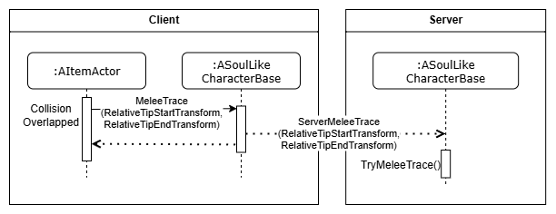

# SoulLike Action RPG


# 목차
1. [프로젝트 개요](#프로젝트-개요)
1. [InventorySystem](#InventorySystem)
1. [WidgetController](#widgetcontroller)
1. [KeyBind](#keybind)
1. [ObjectPoolingSubsystem](#ObjectPoolingSubsystem)
1. [GameplayAbilitySystem](#gameplayabilitysystem)       
    6.1 [FSoulLikeGameplayTags](#FSoulLikeGameplayTags)              
    6.2 [AbilityState](#AbilityState)       
    6.3 [AttackMontage](#AttackMontage)               
    6.4 [TargetLock](#TargetLock)              
    6.5 [InteractionAbility](#InteractionAbility)
1. [플레이 영상](#플레이-영상)

## 프로젝트 개요
Unreal Engine 5 Portfolio
- Unreal Engine 5 버전 : 5.4.4
- 에디터 : VSCode, Rider
- 제작기간 : 2025.03~2025.06 (4개월)
- 개발 인원 : 1인개발

소울라이크 액션을 레퍼런스로 한 액션 RPG     
GAS 기반의 전투 시스템, 동적 키 바인딩, FastArray 기반 인벤토리, MVC 구조의 UI 연동, ObjectPooling 적 리스폰 등을 구현
## InventorySystem
       
InventoryComponent를 통해 Inventory를 관리한다. 아이템의 기능과 정보를 저장한 ItemInstance로 저장
* 멀티플레이를 고려하여 ItemInstance들의 리플리케이션을 최소화 하기 위해 Inventory를 FastArraySerializer를 사용        
* Item의 내부 데이터는 ItemInstance에 UItemData와 FInventoryData에서 보관
  * UItemData : 아이템의 정적 정보
  * FInventoryData : 아이템의 동적 정보
### ItemDataAsset.cpp
```c++
//ItemDataTable을 저장하는 구조체. 해당 DataTable에 맞는 UItemData의 Class를 저장
USTRUCT(BlueprintType)
struct FItemDataTable
{
    GENERATED_BODY()
    
    UPROPERTY(EditDefaultsOnly, BlueprintReadOnly)
    TObjectPtr<UDataTable> DataTable;
    
    UPROPERTY(EditDefaultsOnly, BlueprintReadOnly)
    FGameplayTag ItemTypeTag = FGameplayTag();
    
    UPROPERTY(EditDefaultsOnly, BlueprintReadOnly)
    TSubclassOf<UItemData> ItemDataClass;
};

...
//FSL_ItemData의 하위구조체를 기반으로 UItemData를 생성하고 초기화 해주는 함수
UItemData* UItemDataAsset::FindItemDataFromIndexAndItemType(UObject* Outer, FGameplayTag ItemType, FName ItemID) const
{
    const FSoulLikeGameplayTags& GameplayTags = FSoulLikeGameplayTags::Get();
    
    for(const FItemDataTable& ItemDataTableStruct : ItemDataTables)
    {
        if(ItemType.MatchesTagExact(ItemDataTableStruct.ItemTypeTag))
        {
            FSL_ItemData* ItemData = ItemDataTableStruct.DataTable->FindRow<FSL_ItemData>(ItemID, FString("Not Found"));
            if(ItemData == nullptr) return nullptr;
    
            if (Outer && ItemDataTableStruct.ItemDataClass != nullptr)
            {
                    //등록되어있는 ItemDataClass로 형 변환해서 생성
                UItemData* ItemDataObject = NewObject<UItemData>(Outer, ItemDataTableStruct.ItemDataClass.Get());
                ItemDataObject->Init(ItemData);
    
                return ItemDataObject;
            }
        
        }
    }
    
    return nullptr;
}
```
### SoulLikeItemTypes.h
```c++
UCLASS(BlueprintType)
class UWeaponData : public UEquipmentData
{
    GENERATED_BODY()

public:
    
    virtual void Init(const FSL_ItemData* ItemData) override
    {
        Super::Init(ItemData);
        const FSL_WeaponData* WeaponData = static_cast<const FSL_WeaponData*>(ItemData);

        if(WeaponData == nullptr) return;
	    
        ...
    }
}
```
DataTable에 저장된 FSL_ItemData를 UItemData로 변환 과정
1. ItemInstance를 생성할 때 FindItemDataFromIndexAndItemType() 팩토리 함수 사용
2. ItemID와 ItemTag(FGameplayTag)로 FSL_ItemData를 탐색
3. 탐색한 FSL_ItemData로 UItemData를 생성, 생성한 ItemData를 ItemInstance에 저장
## WidgetController
   
결합도를 낮추고 코드의 재사용성을 높이기 위해 WidgetController를 사용하여 Model(게임로직)과 View(UI)를 분리하여 설계.    
클라이언트를 조작중인 PlayerController는 한개만 존재할 수 있고, 해당 PlayerController에서만 HUD가 생성. 따라서 HUD는 싱글톤 처럼 동작.
- 현재 클라이언트를 조종하는 Controller는 싱글톤처럼 한개의 객체만 존재하고 HUD또한 한개만 존재
- 클라이언트에 하나만 존재하는 Controller의 HUD에 WidgetController를 생성
- UBlueprintFunctionLibrary를 재정의 한 Static Helper Function을 사용해서 HUD의 WidgetController를 사용

### SoulLikeFunctionLibrary.cpp
```c++
//WidgetController를 초기화 하기 위한 FWidgetControllerParams 생성 함수
bool USoulLikeFunctionLibrary::MakeWidgetControllerParams(const UObject* WorldContextObject,
                                                          ASoulLikeHUD*& OutSoulLikeHUD, FWidgetControllerParams& OutWCParams)
{
    if(APlayerController* PC = UGameplayStatics::GetPlayerController(WorldContextObject, 0))
    {
        OutSoulLikeHUD = Cast<ASoulLikeHUD>(PC->GetHUD());
        if(OutSoulLikeHUD != nullptr)
        {
            ASoulLikePlayerState* PS = PC->GetPlayerState<ASoulLikePlayerState>();
            UAbilitySystemComponent* ASC = PS->GetAbilitySystemComponent();
            UAttributeSet* AS = PS->GetAttributeSet();
            OutWCParams.PlayerController = PC;
            OutWCParams.PlayerState = PS;
            OutWCParams.AbilitySystemComponent = ASC;
            OutWCParams.AttributeSet = AS;
            return true;
        }
    }
    return false;
}
    
UInventoryWidgetController* USoulLikeFunctionLibrary::GetInventoryWidgetController(const UObject* WorldContextObject)
{
    FWidgetControllerParams Params;
    ASoulLikeHUD* SoulLikeHUD;
    const bool bSuccessfulMakingParams = MakeWidgetControllerParams(WorldContextObject, SoulLikeHUD, Params);
    if(bSuccessfulMakingParams)
    {
        return SoulLikeHUD->GetInventoryWidgetController(Params);
    }
    return nullptr;
}
```
### SoulLikeHUD.cpp
```c++
UInventoryWidgetController* ASoulLikeHUD::GetInventoryWidgetController(const FWidgetControllerParams& WCParams)
{
    if(InventoryWidgetController == nullptr){
    
        InventoryWidgetController = NewObject<UInventoryWidgetController>(this, InventoryWidgetControllerClass);
        InventoryWidgetController->SetWidgetControllerParams(WCParams);
        InventoryWidgetController->BindCallbacksToModels();
    }
    return InventoryWidgetController;
}
```
WidgetController와 Widget, Model들과 WidgetController는 Delegate를 통해 통신     
단방향으로 작동하며 View와 Model간의 의존성을 줄임

>     
> 인벤토리 갱신 시퀀스와 장비장착 시퀀스

* InventoryList에 변화가 생긴다면, InventoryWidgetController의 Delegate에 의해 SoulLikeUserWidget에 Bind된 Callback함수로 InventoryWidget 갱신
* Widget의 Button을 상호작용 했다면, InventoryWidgetController를 통해 InventoryComponent에 Bind 된 아이탬 장착 함수를 호출한다.

## KeyBind

>      
Input을 대기하는 상태(InputMode_KeyBind)

      
FGameplayTag(InputTag)를 식별자로 사용하여 InputAction과 Ability활성화를 바인드 하는 구조  
- EnhancedInput의 InputAction 기반 구조를 확장하여 Ability의 InputTag 변경을 통해, 각 Ability의 단축키등록을 동적으로 변경 할 수 있도록 설계        
- InputTag를 InputAction과 Ability에 각각 매칭. Ability의 매칭된 InputTag를 변경하는 것으로 InputAction과 Ability의 매칭을 유저가 게임내에서 UI를 통해 변경가능
### SoulLikeInputComponent.h
```c++
template <class UserClass, typename PressedFuncType, typename HeldFuncType, typename ReleasedFuncType>
inline void USoulLikeInputComponent::BindAbilityActions(const USL_InputConfig* InputConfig, UserClass* Object,
	PressedFuncType PressedFunc, HeldFuncType HeldFunc, ReleasedFuncType ReleasedFunc)
{
    check(InputConfig);
  
    //해당하는 Event에 맞는 InputTag를 매개변수로 Callback함수를 Bind
    for(const FSL_InputAction& InputAction : InputConfig->InputActions)
    {
        if(PressedFunc) BindAction(InputAction.InputAction, ETriggerEvent::Started, Object, PressedFunc, InputAction.InputTag);
        if(HeldFunc) BindAction(InputAction.InputAction, ETriggerEvent::Triggered, Object, HeldFunc, InputAction.InputTag);
        if(ReleasedFunc) BindAction(InputAction.InputAction, ETriggerEvent::Completed, Object, ReleasedFunc, InputAction.InputTag);
    }
}
```
### SoulLikeInputComponent.h
```c++
template <class UserClass, typename PressedFuncType, typename HeldFuncType, typename ReleasedFuncType>
inline void USoulLikeInputComponent::BindAbilityActions(const USL_InputConfig* InputConfig, UserClass* Object,
	PressedFuncType PressedFunc, HeldFuncType HeldFunc, ReleasedFuncType ReleasedFunc)
{
    check(InputConfig);
  
    //해당하는 Event에 맞는 InputTag를 매개변수로 Callback함수를 Bind
    for(const FSL_InputAction& InputAction : InputConfig->InputActions)
    {
        if(PressedFunc) BindAction(InputAction.InputAction, ETriggerEvent::Started, Object, PressedFunc, InputAction.InputTag);
        if(HeldFunc) BindAction(InputAction.InputAction, ETriggerEvent::Triggered, Object, HeldFunc, InputAction.InputTag);
        if(ReleasedFunc) BindAction(InputAction.InputAction, ETriggerEvent::Completed, Object, ReleasedFunc, InputAction.InputTag);
    }
}
```
- EnhancedInput의 InputAction을 GameplayTag(InputTag)와 매핑       
- InputTag를 캐릭터의 어빌리티에 매핑해서 Ability의 TriggerInput을 동적으로 전환할 수 있도록 구현

>      
InputAction이 Trigger 된다면, Execute()를 통해 Callback Function을 호출하고 InputTag로 입력을 구분 하고 해당하는 Abilityspec을 활성화
### SoulLikeAbilitySystemComponent.cpp
```c++
void USoulLikeAbilitySystemComponent::AbilityInputTagHeld(FGameplayTag InputTag)
{
	if(!InputTag.IsValid()) return;

    //ActivateAbility가 RaceCondition에 의해 AbilitySpec이 변경될 수 있으므로 ScopeLock를 사용하여 Mutex Lock
    FScopedAbilityListLock ActivateScopeLock(*this);
    for(FGameplayAbilitySpec& AbilitySpec : GetActivatableAbilities())
    {
        if(AbilitySpec.DynamicAbilityTags.HasTagExact(InputTag))
        {
            ...
            AbilitySpecInputPressed(AbilitySpec);
            if(!AbilitySpec.IsActive())
            {
                TryActivateAbility(AbilitySpec.Handle);
            }
        }
    }
}
```

>      
InputAction과 Ability는 InputTag로 매핑 되어 있기 때문에 Ability의 InputTag를 변경한다면, 매칭된 InputAction 변경 가능
### SoulLikePlayerController.cpp
```c++
void ASoulLikePlayerController::AbilityInputTagPressed(FGameplayTag InputTag)
{
   ...
        //위 사진과 같이 키 입력을 대기하고있는 InputMode_KeyBind 일 경우, 입력된 InputTag로 선택된 Ability의 InputTag 설정
	if(InputMode.MatchesTagExact(FSoulLikeGameplayTags::Get().InputMode_KeyBind))
	{
		ChangeAbilityInputTag(InputTag);
		return;
	}
	
	if(GetASC())
	{
		GetASC()->AbilityInputTagPressed(InputTag);
	}
}

void ASoulLikePlayerController::ChangeAbilityInputTag(const FGameplayTag& InputTag)
{
	if(UKeybindMenuWidgetController* KeybindMenuWidgetController = USoulLikeFunctionLibrary::GetKeybindMenuWidgetController(this))
	{
		if(GetASC())
		{
			GetASC()->ChangeAbilityInputTag(KeybindMenuWidgetController, InputTag);
		}
	}
}
```
### SoulLikeAbilitySystemComponent.cpp
```c++
void USoulLikeAbilitySystemComponent::ChangeAbilityInputTag(UKeybindMenuWidgetController* KeybindMenuWidgetController, const FGameplayTag& InputTag)
{
	UAbilityInfo* AbilityInfo = USoulLikeFunctionLibrary::GetAbilityInfo(this);
	if(AbilityInfo == nullptr) return;

	if(KeybindMenuWidgetController == nullptr) return;

	const FGameplayTag SelectedAbilityTag = KeybindMenuWidgetController->SelectedAbilityTag;
	//변경할 InputTag를 가지고 있는 어빌리티는 초기화
	if(FGameplayAbilitySpec* PrevAbilitySpec = GetSpecFromInputTag(InputTag))
	{
		const FGameplayTag& PrevAbilityTag = GetAbilityTagFromSpec(*PrevAbilitySpec);
		
		PrevAbilitySpec->DynamicAbilityTags.RemoveTag(InputTag);
		
		AbilityInfo->ChangeAbilityInputTag(PrevAbilityTag, FGameplayTag());
		
		//변경된 AbilitySpec 갱신
		MarkAbilitySpecDirty(*PrevAbilitySpec);
		
		KeybindMenuWidgetController->OnReceiveInputTagDelegate.Broadcast(PrevAbilityTag);
	}
	//변경할 어빌리티 태그에 InputTag추가
	if(FGameplayAbilitySpec* AbilitySpec = GetSpecFromAbilityTag(SelectedAbilityTag))
	{
		AbilitySpec->DynamicAbilityTags.RemoveTag(AbilityInfo->GetAbilityInputTag(SelectedAbilityTag));
		
		AbilityInfo->ChangeAbilityInputTag(SelectedAbilityTag, InputTag);

		AbilitySpec->DynamicAbilityTags.AddTag(InputTag);
		
		//변경된 AbilitySpec 갱신
		MarkAbilitySpecDirty(*AbilitySpec);
		
		//Widget을 Delegate를 통해 갱신
		KeybindMenuWidgetController->SelectedAbilityTag = FGameplayTag();
		KeybindMenuWidgetController->OnReceiveInputTagDelegate.Broadcast(SelectedAbilityTag);
	}
}
```

## ObjectPoolingSubsystem
      
Enemy를 스폰할 때 SpawnActor를 사용해서 매번 Enemy를 Spawn하면 최적화에 영향을 끼치기 때문에 ObjectPool로 EnemySpawn을 구현.    
Enemy가 비활성화(죽음, 휴식으로 인한 레벨 내 적 초기화)시 Pool에 반환하고, Spawn할 때 Pool 안의 Enemy를 활성화하여 사용.
### Enemy 동적 초기화

```c++
void ASoulLikeEnemy::Init(AActor* InSpawnerActor, FEnemyData Data)
{
	EnemyData = Data;
	SpawnerActor = InSpawnerActor;
	//EnemyData로 ASoulLikeEnmey를 초기화
	SetupActorWithEnmeyData();
	...
}
```
Pool에서 Enemy를 활성화하고 사용하려면 활성화 할 때 동적으로 Enemy를 초기화 필요.   
따라서 FEnemyData를 DataTable에 정의하여 초기화 할 때 EnemyData를 사용하여 Enemy를 초기화.

>     
EnemySpawn Sequence
```c++
ASoulLikeEnemy* UObjectPoolingSubsystem::SpawnEnemy(AActor* SpawnerActor, const TSubclassOf<ASoulLikeEnemy>& SpawnActorClass, FName RowName)
{
	FScopeLock Lock(&PoolLock);
	
	if(SpawnerActor == nullptr) return nullptr;
	if(!SpawnActorClass->IsValidLowLevel()) return nullptr;
	
	FEnemyData* Data = EnemyDataAssset->EnemyDataTable->FindRow<FEnemyData>(RowName, FString(""), false);
	if(Data == nullptr) return nullptr;
	
 	if(EnemyObjectPool.Num() < MaxPoolSize)
	{
		FTransform SpawnTransform = SpawnerActor->GetTransform();
		
		if(UWorld* World = SpawnerActor->GetWorld())
		{
			ASoulLikeEnemy* EnemyActor = World->SpawnActorDeferred<ASoulLikeEnemy>(Data->EnemyClass, SpawnTransform, SpawnerActor);
			if(IObjectPoolingInterface* Interface = Cast<IObjectPoolingInterface>(EnemyActor))
			{
				if(Data != nullptr)
				{
					EnemyActor->Init(SpawnerActor, *Data);
				}
				EnemyActor->OnDisabledObjectDelegate.AddDynamic(this, &UObjectPoolingSubsystem::OnEnemyDisabledObject);
				EnemyActor->SpawnDefaultController();
				EnemyActor->FinishSpawning(SpawnTransform);
			
				EnemyObjectPool.Add(EnemyActor);
				return EnemyActor;
			}
		}
	}
	else
	{
 		if(!EnemyObjectPoolQueue.IsEmpty())
		{
			AActor* PooledObject  = nullptr;
			if(EnemyObjectPoolQueue.Dequeue(PooledObject))
			{
				if(ASoulLikeEnemy* EnemyActor = Cast<ASoulLikeEnemy>(PooledObject))
				{
					EnemyActor->SetActorTransform(SpawnerActor->GetTransform(), false,  nullptr, ETeleportType::ResetPhysics);
					if(Data != nullptr)
					{
						EnemyActor->Init(SpawnerActor, *Data);
					}
					EnemyActor->SpawnDefaultController();
					return EnemyActor;
				}
			}
		}
	}
	return nullptr;
}
```
### Enemy Pool반환
Enemy가 Disable 될 때, Broadcast를 통해 PoolQueue에 Enemy를 반환.
```c++
ASoulLikeEnemy* UObjectPoolingSubsystem::SpawnEnemy(AActor* SpawnerActor, const TSubclassOf<ASoulLikeEnemy>& SpawnActorClass, FName RowName)
{
        ...
        if(Data != nullptr)
        {
            EnemyActor->Init(SpawnerActor, *Data);
        }
        EnemyActor->OnDisabledObjectDelegate.AddDynamic(this, &UObjectPoolingSubsystem::OnEnemyDisabledObject);
}

void UObjectPoolingSubsystem::OnEnemyDisabledObject(AActor* Actor)
{
	FScopeLock Lock(&PoolLock);
	
	EnemyObjectPoolQueue.Enqueue(Actor);
}

```
### Pool ScopeLock
     
여러개의 오브젝트가 동시에 하나의 Subsystem의 객체에 접근, 관여할 수 있기 때문에    
ScopeLock을 통해 PoolQueue를 사용하는 동안에 다른 접근을 차단.
```c++
FScopeLock Lock(&PoolLock);
```

## MeleeTrace
        
근접 공격은 클라이언트에서 Montage 재생 중 무기 Collision이 적과 Overlap되면 발생  
이 때 서버에 캐릭터에 대한 무기의 소켓의 상대적인 위치를 전달하고,        
서버에서는 다시 한번 해당 위치에서 Trace를 수행하여 공격이 유효한지 검증
```c++
void AItemActor::OnOverlap(UPrimitiveComponent* OverlappedComponent,
	AActor* OtherActor, UPrimitiveComponent* OtherComp, int32 OtherBodyIndex, bool bFromSweep,
	const FHitResult& SweepResult)
{
	if(OtherActor == GetOwner()) return;
 	
	// 서버에서 검증하지 않는 단순한 방법
	// const FVector TipStart = MeshComponent->GetSocketLocation(FName("TipStart"));
	// const FVector TipEnd = MeshComponent->GetSocketLocation(FName("TipEnd"));

	// 클라이언트에서의 무기와 Owner와의 상대적인 Transform을 보내서 서버에서 캐릭터의 위치를 기반으로 socket의 Transform을 다시 계산
	FTransform TipStartTransform = MeshComponent->GetSocketTransform("TipStart", RTS_World);
	FTransform TipEndTransform = MeshComponent->GetSocketTransform("TipEnd", RTS_World);
	FTransform ParentWorldTransform = GetOwner()->GetActorTransform();
	FTransform TipStartRelativeToParent = TipStartTransform.GetRelativeTransform(ParentWorldTransform);
	FTransform TipEndRelativeToParent = TipEndTransform.GetRelativeTransform(ParentWorldTransform);
	
	...
}
```
```c++
void ASoulLikeCharacterBase::TryMeleeTrace(const FTransform& TraceStartRelativeTransform,
	const FTransform& TraceEndRelativeTransform, float Radius)
{
	const bool bDebug = static_cast<bool>(CVarShowAttackTrace.GetValueOnAnyThread());

	TArray<FHitResult> HitResults;

	FTransform TraceStartTransform = TraceStartRelativeTransform * GetActorTransform();
	FTransform TraceEndTransform = TraceEndRelativeTransform * GetActorTransform();

	FVector TraceStart = TraceStartTransform.GetLocation();
	FVector TraceEnd = TraceEndTransform.GetLocation();
	
	...
}
```

## GameplayAbilitySystem
GAS는 캐릭터의 액션/상태 구현을 위해 사용한 프레임워크
공격, 상호작용, 스테이터스, 아이탬 사용, 타겟고정, 구르기등의 핵심기능 구현

### FSoulLikeGameplayTags
FGameplayTag는 문자열을 "."로 구분하여 계층을 나누어 분류하는 계층형 식별자

```c++
struct FSoulLikeGameplayTags
{
public:

	static const FSoulLikeGameplayTags& Get();
	
	static void InitializeNativeGameplayTags();

	/**
	 * Primary Attribute
	 * 기본 Attribute
	 */
	FGameplayTag Attributes_Primary_Vigor;
        ...	
}

FSoulLikeGameplayTags FSoulLikeGameplayTags::GameplayTags;

const FSoulLikeGameplayTags& FSoulLikeGameplayTags::Get()
{
        if(!GameplayTags.bInit)
        {
             InitializeNativeGameplayTags();
        }
        return GameplayTags;
}

void FSoulLikeGameplayTags::InitializeNativeGameplayTags()
{
        if(GameplayTags.bInit) return;

	const FGameplayTag CheckTag = FGameplayTag::RequestGameplayTag(FName("Attributes.Primary.Vigor"), false);
	if (CheckTag.IsValid())
	{
		// 이미 태그가 등록되어 있으면 초기화 생략
		GameplayTags.bInit = true;
		return;
	}
	/**
	 * Primary Attribute
	 */

	GameplayTags.Attributes_Primary_Vigor = UGameplayTagsManager::Get().AddNativeGameplayTag(
		FName("Attributes.Primary.Vigor"),
		FString("Increase Health Point")
	);
}
```
FSoulLikeGameplayTags는 정적 싱글톤 객체
* FGameplayTag를 간편하게 사용할 수 있도록 정적 싱글톤 객체에서 FGameplayTag들을 초기화 한다.     
* 초기화 한 FGameplayTag는 변수로써 싱글톤 객체에서 접근할 수 있다.

### AbilityState
 
```c++
UENUM(BlueprintType)
enum class EAbilityState : uint8
{   
    EAS_None UMETA(DisplayName = "None"),
    EAS_WaitInput UMETA(DisplayName = "Input Wait"),
    EAS_NextAction UMETA(DisplayName = "Next Action")
};
```
액션 선입력과 다음 액션 활성화를 위해 CombatAbility에 Montage 진행에 따른 상태를 저장.   
Ability State
- None       : 기본 상태
- WaitInput  : 입력을 받는 상태 
- NextAction : 다음 액션을 활성활 할 수 있는 상태

상태를 나눠서 모든 액션에 선입력, 액션 후 딜레이를 Montage의 Notify를 통해 설정 가능.

### AttackMontage

```c++
void USoulLikeComboAbility::SetupMontage()
{
	if(GetAvatarActorFromActorInfo()->Implements<UCombatInterface>())
	{
		Montage = ICombatInterface::Execute_GetCurrentWeaponAttackMontage(GetAvatarActorFromActorInfo());
	}
}
```
ComboAbility는 현재 객체가 장착한 Weapon의 Montage를 재생
Weapon의 데이터는 DataTable에서 정의하므로, DataTable을 통해 각 무기의 공격 애니메이션 변경 가능

### TargetLock
타겟방향으로 카메라를 회전시키는 어빌리티. 비동기 작업인 AbilityTask를 사용   
타겟을 변경하거나 고정하는 경우
>       
>1. 애임으로 적을 직접 선택 했거나, 범위 내 가장 가까운 적에 고정        
<details>
    <summary>코드 보기</summary>

```c++
//TargetLockGameplayAbility.cpp

FHitResult AimHitResult;
FTraceProperties AnimTraceProperties(TraceLength, SingleTraceCollisionChannel, SingleTraceSphereRadius, DebugLifeTime);
FTraceProperties MultiTraceProperties(TraceLength, MultiTraceCollisionChannel, MultiTraceSphereRadius, DebugLifeTime);

if(USoulLikeFunctionLibrary::SingleTraceFromCameraLocation(GetAvatarActorFromActorInfo(), AimHitResult, AnimTraceProperties, bDebug))
{
    bIsTargetLock = true;
    if(AimHitResult.GetActor())
    {
        TargetActor = AimHitResult.GetActor();
    }
}

//SoulLikeFunctionLibrary.cpp
bool USoulLikeFunctionLibrary::SingleTraceFromCameraLocation(const AActor* Instigator, FHitResult& HitResult,
                                                             FTraceProperties TraceProperties, bool bDebug)
{
    FVector TraceStartLocation = FVector::ZeroVector;
    FVector TraceEndLocation = FVector::ZeroVector;
    FVector TraceForwardVector = FVector::ZeroVector;
    
    if(!SetupTraceProperties(Instigator, TraceStartLocation, TraceEndLocation, TraceForwardVector, TraceProperties.TraceLength)) return false;
    
    FCollisionQueryParams Params(NAME_None, false, Instigator);
    
    UWorld* World = Instigator->GetWorld();
    if(World == nullptr) return false;
    
    bool bResult = World->SweepSingleByChannel(
        HitResult,
        TraceStartLocation + (TraceForwardVector * TraceProperties.TraceSphereRadius),
        TraceEndLocation - (TraceForwardVector * TraceProperties.TraceSphereRadius),
        FQuat::Identity,
        TraceProperties.TraceCollisionChannel,
        FCollisionShape::MakeSphere(TraceProperties.TraceSphereRadius),
        Params);
    
    if(bResult)
    {
        if(HitResult.GetActor())
        {
            bResult = HitResult.GetActor()->IsA(ASoulLikeCharacterBase::StaticClass());
            
            if(bDebug)
            {
                FVector TraceVec = TraceForwardVector;
                FVector Center = TraceStartLocation + TraceForwardVector * TraceProperties.TraceLength / 2;
                float HalfHeight = TraceProperties.TraceLength / 2.f;
                FQuat CapsuleRot = FRotationMatrix::MakeFromZ(TraceVec).ToQuat();
                FColor DrawColor = bResult ? FColor::Green : FColor::Red;
    
                DrawDebugCapsule(World,
                    Center,
                    HalfHeight,
                    5.0f,
                    CapsuleRot,
                    DrawColor,
                    false,
                    TraceProperties.DebugLifeTime);
            }
            
            return bResult;
        }
    }
    
    return false;
}
```
</details>

>
>2. 현재 타겟 고정이 되어있는 상태에서 다른 타겟으로 타겟을 변경
<details>
    <summary>코드 보기</summary>

```c++
//AbilityTask_TargetLock.cpp
void UAbilityTask_TargetLock::TryChangeTargetActor()
{
    if(TargetActor.IsValid() && !USoulLikeFunctionLibrary::CheckTargetOnViewport(TargetActor.Get(), 0.2f)) return;
    if(!bCanChangeTarget) return;
    
    bool LeftTrace = false;
    bool RightTrace = false;
    
    float NextTargetDegree = 0.f;
    
    ASoulLikeCharacter* Character = Cast<ASoulLikeCharacter>(GetAvatarActor());
    if(Character == nullptr) return;
    
    
    UCameraComponent* Camera = Character->GetPlayerCameraComponent();
    if(Camera == nullptr) return;
    
    if(Character->GetMouseXInput() > 8.f)
    {
        RightTrace = true;
        NextTargetDegree = 360.f;
    }
    else if(Character->GetMouseXInput() < -8.f)
    {
        LeftTrace = true;
        NextTargetDegree = -360.f;
    }
    
    if(!LeftTrace && !RightTrace) return;
    
    AActor* NewTargetActor = nullptr;
    TArray<FHitResult> HitResults;
    
    const bool bDebug = static_cast<bool>(CVarShowTargetLockTrace.GetValueOnAnyThread());
    USoulLikeFunctionLibrary::MultiTraceFromCameraLocation(Character, HitResults, TraceProperties, bDebug);
    
    for(const FHitResult& HitResult : HitResults)
    {
        AActor* CurrentTargetActor = HitResult.GetActor();
        if(CurrentTargetActor == nullptr) continue;
        
        float LookAtTargetRotatorYaw = FRotationMatrix::MakeFromX(CurrentTargetActor->GetActorLocation() - Camera->GetComponentLocation()).Rotator().Yaw;
        float CurrentTargetDegree = FRotator::ClampAxis(LookAtTargetRotatorYaw - Camera->GetComponentRotation().Yaw);
    
        if(bDebug)
        {
            DrawDebugString(GetWorld(), CurrentTargetActor->GetActorLocation() + FVector(0.f, 0.f, 20.f), FString::SanitizeFloat(CurrentTargetDegree), 0, FColor::White, 5.f);
        }
    
        if(TargetActor != CurrentTargetActor && 
            ((CurrentTargetDegree > 180.f && CurrentTargetDegree > NextTargetDegree && LeftTrace)||
                (CurrentTargetDegree < 180.f && CurrentTargetDegree < NextTargetDegree && RightTrace)))
        {
            NextTargetDegree = CurrentTargetDegree;
            NewTargetActor = CurrentTargetActor;
        }
    }
    
    if(NewTargetActor != nullptr && NewTargetActor != TargetActor && NewTargetActor->Implements<UCombatInterface>() && USoulLikeFunctionLibrary::CheckTargetOnViewport(NewTargetActor, 0.2f))
    {
        ICombatInterface::Execute_ToggleTargetMark(TargetActor.Get());
        TargetActor = NewTargetActor;
        
        ChangedTargetActorDelegate.Broadcast(TargetActor.Get());
        
        ICombatInterface::Execute_ToggleTargetMark(TargetActor.Get());
    
        bCanChangeTarget = false;
        GetWorld()->GetTimerManager().ClearTimer(LockOnTimerHandle);
        GetWorld()->GetTimerManager().SetTimer(LockOnTimerHandle, FTimerDelegate::CreateLambda([&](){
            bCanChangeTarget = true;
        }), 1.f, false);
    }
}
```
</details>

>
>3. 타겟이 죽었다면, 가장 가까운 적에게 타겟고정
<details>
    <summary>코드 보기</summary>

```c++
//AbilityTask_TargetLock.cpp
void UAbilityTask_TargetLock::OnDeathTargetActor()
{
    GetWorld()->GetTimerManager().ClearTimer(TargetDeathTimerHandle);
    GetWorld()->GetTimerManager().SetTimer(TargetDeathTimerHandle, FTimerDelegate::CreateLambda([&]()
    {
        TArray<FHitResult> TargetHitResults;
        AActor* NewTargetActor = nullptr;
        const bool bDebug = static_cast<bool>(CVarShowTargetLockTrace.GetValueOnAnyThread());
        if(USoulLikeFunctionLibrary::MultiTraceFromCameraLocation(GetAvatarActor(), TargetHitResults, TraceProperties, bDebug))
        {
            float NearestDistance = 5000.f;
    
            for(const FHitResult& TargetHitResult : TargetHitResults)
            {
                AActor* CurrentTargetActor = TargetHitResult.GetActor();
                if(CurrentTargetActor == nullptr) return;
    
                float DistanceToTarget = FVector::Distance(GetAvatarActor()->GetActorLocation(), CurrentTargetActor->GetActorLocation());
    
                if(DistanceToTarget < NearestDistance)
                {
                    NearestDistance = DistanceToTarget;
                    NewTargetActor = CurrentTargetActor;
                }
            }
        }
    
        if(NewTargetActor && TargetActor.Get())
        {
            ICombatInterface::Execute_ToggleTargetMark(TargetActor.Get());
            TargetActor = NewTargetActor;
            ICombatInterface::Execute_ToggleTargetMark(NewTargetActor);
            if(ICombatInterface* CombatInterface = Cast<ICombatInterface>(TargetActor))
            {
                CombatInterface->GetOnDeathDelegate().AddDynamic(this, &UAbilityTask_TargetLock::OnDeathTargetActor);
            }
        }
        ChangedTargetActorDelegate.Broadcast(NewTargetActor);
    }), 1.f, false);
}
```
</details>

### InteractionAbility

캐릭터와 오브젝트가 상호작용 동작을 처리하는 어빌리티       
* 상호 작용은 FGameplayTag로 분류     
* IInteractionInterface를 구현하여 각각 캐릭터와 액터의 상호 작용 구현  

>
> DataAsset "DA_AbilityInfo"에서 관리
> ```c++
> if(InteractionTaskInfo.InteractionTag.MatchesTagExact(FSoulLikeGameplayTags::Get().Interaction_Ladder))
>	{
>		InteractionTask = UAbilityTask_Ladder::CreateLadderTask(this, GetAvatarActorFromActorInfo(), InteractionTaskInfo);
>	}
>	else
>	{
>		InteractionTask = UAbilityTask_Interaction::CreateInteractionTask(this, GetAvatarActorFromActorInfo(), InteractionTaskInfo);
>	}
> ```
> FGameplayTag로 구분해서 Interaction 실행

* 각 상호 작용은 별도의 InteractionAbility를 만들지 않고, 비동기 작업 AbilityTask를 통해 추가, 구현     

#### InteractionTask_Ladder
> 
> 사다리타기 상호작용

비동기 작업 AbilityTask_Interaction에서 Tick마다 캐릭터의 Controller의 위, 아래 InputValue을 가져와 LadderClimbMontageTask를 실행

<details>
    <summary>코드 보기</summary>

```c++
void UAbilityTask_Ladder::TickTask(float DeltaTime)
{
    Super::TickTask(DeltaTime);
    
    //Input을 받을 수 있는 상태이면서 ClimbLoop Animation이 활성화 되지 않았을경우
    //ClimbMontage의 중복작동 막음
    if(bCanReceiveInput &&
        (!IsValid(LadderClimbMontageTask) || !LadderClimbMontageTask->IsActive()))
    {
        FName SectionName = FName("");
        FString Direction = FString("");
        FString RL = FString("");
        
        if(Ability && Ability->GetAvatarActorFromActorInfo()->Implements<UCombatInterface>() && Ability->GetAvatarActorFromActorInfo()->Implements<UInteractionInterface>())
        {
            //InputValue를 가져옴
            float InputValue = ICombatInterface::Execute_GetLadderMoveInput(Ability->GetAvatarActorFromActorInfo());
            //입력이 없다면 함수종료
            if(InputValue == 0.f) return;
            //종결 Montage를 작동해야 하는지에 대한 여부를 확인하기 위해 현재 Overlay된 InteractionActor의 Tag가져옴
            FGameplayTag InteractionTag = IInteractionInterface::Execute_GetInteractionTag(Ability->GetAvatarActorFromActorInfo());
            
            if(InputValue > 0.f)
            {
                Direction = FString("Up");
                //만약 Overlap된 Interaction의 방향이 아래일경우, 위로 올라가는 종결Montage 재생
                if(InteractionTag.MatchesTagExact(FSoulLikeGameplayTags::Get().Interaction_Ladder_Down))
                {
                    bCanReceiveInput = false;
                    UAbilitySystemBlueprintLibrary::SendGameplayEventToActor(Ability->GetAvatarActorFromActorInfo(), InteractionTag, FGameplayEventData());
                    ICombatInterface::Execute_SetLadderMirror(Ability->GetAvatarActorFromActorInfo(), false);
                    ICombatInterface::Execute_SetMirror(Ability->GetAvatarActorFromActorInfo(), bIsRight);
                    return;
                }
            }
            else if(InputValue < 0.f)
            {
                Direction = FString("Down");
                //만약 Overlap된 Interaction의 방향이 위일경우, 아래로 내려가는 종결Montage 재생
                if(InteractionTag.MatchesTagExact(FSoulLikeGameplayTags::Get().Interaction_Ladder_Up))
                {
                    bCanReceiveInput = false;
                    UAbilitySystemBlueprintLibrary::SendGameplayEventToActor(Ability->GetAvatarActorFromActorInfo(), InteractionTag, FGameplayEventData());
                    ICombatInterface::Execute_SetLadderMirror(Ability->GetAvatarActorFromActorInfo(), false);
                    ICombatInterface::Execute_SetMirror(Ability->GetAvatarActorFromActorInfo(), bIsRight);
                    return;
                }
            }
            //현재 상태에 따른 LadderIdle Animation Mirror설정
            //ICombatInterface::Execute_SetLadderMirror(Ability->GetAvatarActorFromActorInfo(), !bIsRight);
        }
        
        if(bIsRight)
        {
            RL = FString("R");
        }
        else
        {
            RL = FString("L");
        }
        //현재 LadderIdle Mirror상태 스위치
        bIsRight = !bIsRight;
        
        SectionName = FName(*FString::Printf(TEXT("%sLoop_%s_%s"), *InteractionTaskInfo.SectionName, *Direction, *RL));
        
        LadderClimbMontageTask = UAbilityTask_PlayMontageAndWait::CreatePlayMontageAndWaitProxy(Ability, FName("LadderLoop"), InteractionTaskInfo.Montage, 1, SectionName);
        LadderClimbMontageTask->ReadyForActivation();
    }
}
```
</details>

※ 데디케이티드 서버에서의 작동       
Standalone에서 컨트롤러의 LocalRole이 Authority이지만, 데디케이디트에선 AutonomousProxy이다.     
InteractionAbility는 Server, Client 두 곳에서 모두 활성화 되지만, InputValue는 Client에만 존재하게 된다.      
따라서 ServerRPC를 통해 Client의 InputValue를 Server에도 동기화 시켜야한다.       

#### SoulLikePlayerController.cpp
```c++
void ASoulLikePlayerController::LadderMove(const FInputActionValue& InputActionValue)
{
	if(GetASC() && !GetASC()->HasMatchingGameplayTag(FSoulLikeGameplayTags::Get().Status_Ladder))
	{
		LadderMoveInput = 0.f;
		return;
	}
	
	const float InputValue = InputActionValue.Get<float>();
	//기존 InputValue와 값이 비슷하다면, ServerRPC를 호출하지 않음
	if (FMath::Abs(InputValue - LadderMoveInput) > KINDA_SMALL_NUMBER)
	{
		LadderMoveInput = InputValue;
		Server_SetLadderMoveInput(InputValue);
	}
}

```
## 플레이 영상
