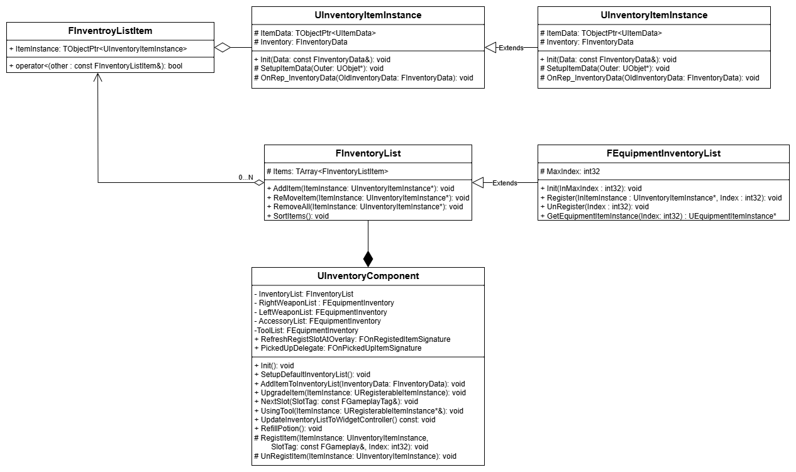

# SoulLike Action RPG

메인사진

# 목차
- [프로젝트 개요](#프로젝트 개요)
- [InventorySystem](#InventorySystem)
- [WidgetController](#widgetcontroller)
- [KeyBind](#keybind)

## 프로젝트 개요
Unreal Engine 5 Portfolio
- Unreal Engine 5 버전 : 5.4.4
- 에디터 : VSCode, Rider
- 제작기간 : 2025.03~2025.06 (4개월)
- 개발 인원 : 1인개발

소울라이크 액션을 레퍼런스로 한 액션 RPG     
GAS 기반의 전투 시스템, 동적 키 바인딩, FastArray 기반 인벤토리, MVC 구조의 UI 연동, ObjectPooling 적 리스폰 등을 구현
## InventorySystem
       
InventoryComponent를 통해 Inventory를 관리한다. 아이템의 기능과 정보를 저장한 ItemInstance로 저장
* 멀티플레이를 고려하여 ItemInstance들의 리플리케이션을 최소화 하기 위해 Inventory를 FastArraySerializer를 사용        
* Item의 내부 데이터는 ItemInstance에 UItemData와 FInventoryData에서 보관
  * UItemData : 아이템의 정적 정보
  * FInventoryData : 아이템의 동적 정보
### ItemDataAsset.cpp
```c++
//ItemDataTable을 저장하는 구조체. 해당 DataTable에 맞는 UItemData의 Class를 저장
USTRUCT(BlueprintType)
struct FItemDataTable
{
	GENERATED_BODY()

	UPROPERTY(EditDefaultsOnly, BlueprintReadOnly)
	TObjectPtr<UDataTable> DataTable;

	UPROPERTY(EditDefaultsOnly, BlueprintReadOnly)
	FGameplayTag ItemTypeTag = FGameplayTag();

	UPROPERTY(EditDefaultsOnly, BlueprintReadOnly)
	TSubclassOf<UItemData> ItemDataClass;
};

...
//FSL_ItemData의 하위구조체를 기반으로 UItemData를 생성하고 초기화 해주는 함수
UItemData* UItemDataAsset::FindItemDataFromIndexAndItemType(UObject* Outer, FGameplayTag ItemType, FName ItemID) const
{
	const FSoulLikeGameplayTags& GameplayTags = FSoulLikeGameplayTags::Get();
	
	for(const FItemDataTable& ItemDataTableStruct : ItemDataTables)
	{
		if(ItemType.MatchesTagExact(ItemDataTableStruct.ItemTypeTag))
		{
			FSL_ItemData* ItemData = ItemDataTableStruct.DataTable->FindRow<FSL_ItemData>(ItemID, FString("Not Found"));
			if(ItemData == nullptr) return nullptr;

			if (Outer && ItemDataTableStruct.ItemDataClass != nullptr)
			{
			        //등록되어있는 ItemDataClass로 형 변환해서 생성
				UItemData* ItemDataObject = NewObject<UItemData>(Outer, ItemDataTableStruct.ItemDataClass.Get());
				ItemDataObject->Init(ItemData);

				return ItemDataObject;
			}
		
		}
	}
	
	return nullptr;
}
```
### SoulLikeItemTypes.h
```c++
UCLASS(BlueprintType)
class UWeaponData : public UEquipmentData
{
    GENERATED_BODY()

public:
    
    virtual void Init(const FSL_ItemData* ItemData) override
    {
        Super::Init(ItemData);
        const FSL_WeaponData* WeaponData = static_cast<const FSL_WeaponData*>(ItemData);

        if(WeaponData == nullptr) return;
	    
        ...
    }
}
```
DataTable에 저장된 FSL_ItemData를 UItemData로 변환 과정
1. ItemInstance를 생성할 때 FindItemDataFromIndexAndItemType() 팩토리 함수 사용
2. ItemID와 ItemTag(FGameplayTag)로 FSL_ItemData를 탐색
3. 탐색한 FSL_ItemData로 UItemData를 생성, 생성한 ItemData를 ItemInstance에 저장
## WidgetController
   
결합도를 낮추고 코드의 재사용성을 높이기 위해 WidgetController를 사용하여 Model(게임로직)과 View(UI)를 분리하여 설계.    
클라이언트를 조작중인 PlayerController는 한개만 존재할 수 있고, 해당 PlayerController에서만 HUD가 생성. 따라서 HUD는 싱글톤 처럼 동작.
- 현재 클라이언트를 조종하는 Controller는 싱글톤처럼 한개의 객체만 존재하고 HUD또한 한개만 존재
- 클라이언트에 하나만 존재하는 Controller의 HUD에 WidgetController를 생성
- UBlueprintFunctionLibrary를 재정의 한 Static Helper Function을 사용해서 HUD의 WidgetController를 사용

### SoulLikeFunctionLibrary.cpp
```c++
//WidgetController를 초기화 하기 위한 FWidgetControllerParams 생성 함수
bool USoulLikeFunctionLibrary::MakeWidgetControllerParams(const UObject* WorldContextObject,
                                                          ASoulLikeHUD*& OutSoulLikeHUD, FWidgetControllerParams& OutWCParams)
{
	if(APlayerController* PC = UGameplayStatics::GetPlayerController(WorldContextObject, 0))
	{
		OutSoulLikeHUD = Cast<ASoulLikeHUD>(PC->GetHUD());
		if(OutSoulLikeHUD != nullptr)
		{
			ASoulLikePlayerState* PS = PC->GetPlayerState<ASoulLikePlayerState>();
			UAbilitySystemComponent* ASC = PS->GetAbilitySystemComponent();
			UAttributeSet* AS = PS->GetAttributeSet();
			OutWCParams.PlayerController = PC;
			OutWCParams.PlayerState = PS;
			OutWCParams.AbilitySystemComponent = ASC;
			OutWCParams.AttributeSet = AS;
			return true;
		}
	}
	return false;
}

UInventoryWidgetController* USoulLikeFunctionLibrary::GetInventoryWidgetController(const UObject* WorldContextObject)
{
	FWidgetControllerParams Params;
	ASoulLikeHUD* SoulLikeHUD;
	const bool bSuccessfulMakingParams = MakeWidgetControllerParams(WorldContextObject, SoulLikeHUD, Params);
	if(bSuccessfulMakingParams)
	{
		return SoulLikeHUD->GetInventoryWidgetController(Params);
	}
	return nullptr;
}
```
### SoulLikeHUD.cpp
```c++
UInventoryWidgetController* ASoulLikeHUD::GetInventoryWidgetController(const FWidgetControllerParams& WCParams)
{
	if(InventoryWidgetController == nullptr){
    
		InventoryWidgetController = NewObject<UInventoryWidgetController>(this, InventoryWidgetControllerClass);
		InventoryWidgetController->SetWidgetControllerParams(WCParams);
		InventoryWidgetController->BindCallbacksToModels();
	}
	return InventoryWidgetController;
}
```
WidgetController와 Widget, Model들과 WidgetController는 Delegate를 통해 통신     
단방향으로 작동하며 View와 Model간의 의존성을 줄임
## KeyBind

>      
Input을 대기하는 상태(InputMode_KeyBind)

      
FGameplayTag(InputTag)를 식별자로 사용하여 InputAction과 Ability활성화를 바인드 하는 구조  
- EnhancedInput의 InputAction 기반 구조를 확장하여 Ability의 InputTag 변경을 통해, 각 Ability의 단축키등록을 동적으로 변경 할 수 있도록 설계        
- InputTag를 InputAction과 Ability에 각각 매칭. Ability의 매칭된 InputTag를 변경하는 것으로 InputAction과 Ability의 매칭을 유저가 게임내에서 UI를 통해 변경가능
### SoulLikeInputComponent.h
```c++
template <class UserClass, typename PressedFuncType, typename HeldFuncType, typename ReleasedFuncType>
inline void USoulLikeInputComponent::BindAbilityActions(const USL_InputConfig* InputConfig, UserClass* Object,
	PressedFuncType PressedFunc, HeldFuncType HeldFunc, ReleasedFuncType ReleasedFunc)
{
    check(InputConfig);
  
    //해당하는 Event에 맞는 InputTag를 매개변수로 Callback함수를 Bind
    for(const FSL_InputAction& InputAction : InputConfig->InputActions)
    {
        if(PressedFunc) BindAction(InputAction.InputAction, ETriggerEvent::Started, Object, PressedFunc, InputAction.InputTag);
        if(HeldFunc) BindAction(InputAction.InputAction, ETriggerEvent::Triggered, Object, HeldFunc, InputAction.InputTag);
        if(ReleasedFunc) BindAction(InputAction.InputAction, ETriggerEvent::Completed, Object, ReleasedFunc, InputAction.InputTag);
    }
}
```
### SoulLikeInputComponent.h
```c++
template <class UserClass, typename PressedFuncType, typename HeldFuncType, typename ReleasedFuncType>
inline void USoulLikeInputComponent::BindAbilityActions(const USL_InputConfig* InputConfig, UserClass* Object,
	PressedFuncType PressedFunc, HeldFuncType HeldFunc, ReleasedFuncType ReleasedFunc)
{
    check(InputConfig);
  
    //해당하는 Event에 맞는 InputTag를 매개변수로 Callback함수를 Bind
    for(const FSL_InputAction& InputAction : InputConfig->InputActions)
    {
        if(PressedFunc) BindAction(InputAction.InputAction, ETriggerEvent::Started, Object, PressedFunc, InputAction.InputTag);
        if(HeldFunc) BindAction(InputAction.InputAction, ETriggerEvent::Triggered, Object, HeldFunc, InputAction.InputTag);
        if(ReleasedFunc) BindAction(InputAction.InputAction, ETriggerEvent::Completed, Object, ReleasedFunc, InputAction.InputTag);
    }
}
```
- EnhancedInput의 InputAction을 GameplayTag(InputTag)와 매핑       
- InputTag를 캐릭터의 어빌리티에 매핑해서 Ability의 TriggerInput을 동적으로 전환할 수 있도록 구현

>      
InputAction이 Trigger 된다면, Execute()를 통해 Callback Function을 호출하고 InputTag로 입력을 구분 하고 해당하는 Abilityspec을 활성화
### SoulLikeAbilitySystemComponent.cpp
```c++
void USoulLikeAbilitySystemComponent::AbilityInputTagHeld(FGameplayTag InputTag)
{
	if(!InputTag.IsValid()) return;

    //ActivateAbility가 RaceCondition에 의해 AbilitySpec이 변경될 수 있으므로 ScopeLock를 사용하여 Mutex Lock
    FScopedAbilityListLock ActivateScopeLock(*this);
    for(FGameplayAbilitySpec& AbilitySpec : GetActivatableAbilities())
    {
        if(AbilitySpec.DynamicAbilityTags.HasTagExact(InputTag))
        {
            ...
            AbilitySpecInputPressed(AbilitySpec);
            if(!AbilitySpec.IsActive())
            {
                TryActivateAbility(AbilitySpec.Handle);
            }
        }
    }
}
```

>      
InputAction과 Ability는 InputTag로 매핑 되어 있기 때문에 Ability의 InputTag를 변경한다면, 매칭된 InputAction 변경 가능
### SoulLikePlayerController.cpp
```c++
void ASoulLikePlayerController::AbilityInputTagPressed(FGameplayTag InputTag)
{
   ...
        //위 사진과 같이 키 입력을 대기하고있는 InputMode_KeyBind 일 경우, 입력된 InputTag로 선택된 Ability의 InputTag 설정
	if(InputMode.MatchesTagExact(FSoulLikeGameplayTags::Get().InputMode_KeyBind))
	{
		ChangeAbilityInputTag(InputTag);
		return;
	}
	
	if(GetASC())
	{
		GetASC()->AbilityInputTagPressed(InputTag);
	}
}

void ASoulLikePlayerController::ChangeAbilityInputTag(const FGameplayTag& InputTag)
{
	if(UKeybindMenuWidgetController* KeybindMenuWidgetController = USoulLikeFunctionLibrary::GetKeybindMenuWidgetController(this))
	{
		if(GetASC())
		{
			GetASC()->ChangeAbilityInputTag(KeybindMenuWidgetController, InputTag);
		}
	}
}
```
### SoulLikeAbilitySystemComponent.cpp
```c++
void USoulLikeAbilitySystemComponent::ChangeAbilityInputTag(UKeybindMenuWidgetController* KeybindMenuWidgetController, const FGameplayTag& InputTag)
{
	UAbilityInfo* AbilityInfo = USoulLikeFunctionLibrary::GetAbilityInfo(this);
	if(AbilityInfo == nullptr) return;

	if(KeybindMenuWidgetController == nullptr) return;

	const FGameplayTag SelectedAbilityTag = KeybindMenuWidgetController->SelectedAbilityTag;
	//변경할 InputTag를 가지고 있는 어빌리티는 초기화
	if(FGameplayAbilitySpec* PrevAbilitySpec = GetSpecFromInputTag(InputTag))
	{
		const FGameplayTag& PrevAbilityTag = GetAbilityTagFromSpec(*PrevAbilitySpec);
		
		PrevAbilitySpec->DynamicAbilityTags.RemoveTag(InputTag);
		
		AbilityInfo->ChangeAbilityInputTag(PrevAbilityTag, FGameplayTag());
		
		//변경된 AbilitySpec 갱신
		MarkAbilitySpecDirty(*PrevAbilitySpec);
		
		KeybindMenuWidgetController->OnReceiveInputTagDelegate.Broadcast(PrevAbilityTag);
	}
	//변경할 어빌리티 태그에 InputTag추가
	if(FGameplayAbilitySpec* AbilitySpec = GetSpecFromAbilityTag(SelectedAbilityTag))
	{
		AbilitySpec->DynamicAbilityTags.RemoveTag(AbilityInfo->GetAbilityInputTag(SelectedAbilityTag));
		
		AbilityInfo->ChangeAbilityInputTag(SelectedAbilityTag, InputTag);

		AbilitySpec->DynamicAbilityTags.AddTag(InputTag);
		
		//변경된 AbilitySpec 갱신
		MarkAbilitySpecDirty(*AbilitySpec);
		
		//Widget을 Delegate를 통해 갱신
		KeybindMenuWidgetController->SelectedAbilityTag = FGameplayTag();
		KeybindMenuWidgetController->OnReceiveInputTagDelegate.Broadcast(SelectedAbilityTag);
	}
}
```

## ObjectPoolingSubsystem
     
Enemy의 ObjectPoolingSubsystem 구조       
GameInstanceSubsystem을 기반으로 구현하여, 싱글톤 구조로 모든 SpawnPointActor에서 접근할 수 있도록 구현     
적을 생성하거나 ObjectPool에 반환하여 적 생성/제거를 관리

     
EnemySpawn Workflow     
너무 많은 함수호출을 막기 위해 Tick()은 1초에 1번 호출 되도록 빈도 조절  
ASoulLikeEnemy는 Disable됬다면 Bind 해둔 OnEnemyDisabledObject()를 호출 해서 ObjectPoolQueue에 대기 시키고,        
다시 Spawn 해야 할 때 활성화
```c++
ASoulLikeEnemy* UObjectPoolingSubsystem::SpawnEnemy(AActor* SpawnerActor, const TSubclassOf<ASoulLikeEnemy>& SpawnActorClass, FName RowName)
{
	FScopeLock Lock(&PoolLock);
	
	if(SpawnerActor == nullptr) return nullptr;
	if(!SpawnActorClass->IsValidLowLevel()) return nullptr;
	
	FEnemyData* Data = EnemyDataAssset->EnemyDataTable->FindRow<FEnemyData>(RowName, FString(""), false);
	if(Data == nullptr) return nullptr;
	
 	if(EnemyObjectPool.Num() < MaxPoolSize)
	{
		FTransform SpawnTransform = SpawnerActor->GetTransform();
		
		if(UWorld* World = SpawnerActor->GetWorld())
		{
			ASoulLikeEnemy* EnemyActor = World->SpawnActorDeferred<ASoulLikeEnemy>(Data->EnemyClass, SpawnTransform, SpawnerActor);
			if(IObjectPoolingInterface* Interface = Cast<IObjectPoolingInterface>(EnemyActor))
			{
				if(Data != nullptr)
				{
					EnemyActor->Init(SpawnerActor, *Data);
				}
				EnemyActor->OnDisabledObjectDelegate.AddDynamic(this, &UObjectPoolingSubsystem::OnEnemyDisabledObject);
				EnemyActor->SpawnDefaultController();
				EnemyActor->FinishSpawning(SpawnTransform);
			
				EnemyObjectPool.Add(EnemyActor);
				return EnemyActor;
			}
		}
	}
	else
	{
 		if(!EnemyObjectPoolQueue.IsEmpty())
		{
			AActor* PooledObject  = nullptr;
			if(EnemyObjectPoolQueue.Dequeue(PooledObject))
			{
				if(ASoulLikeEnemy* EnemyActor = Cast<ASoulLikeEnemy>(PooledObject))
				{
					EnemyActor->SetActorTransform(SpawnerActor->GetTransform(), false,  nullptr, ETeleportType::ResetPhysics);
					if(Data != nullptr)
					{
						EnemyActor->Init(SpawnerActor, *Data);
					}
					EnemyActor->SpawnDefaultController();
					return EnemyActor;
				}
			}
		}
	}
	return nullptr;
}
```
여러개의 오브젝트가 동시에 하나의 Subsystem의 객체에 접근, 관여할 수 있기 때문에
ScopeLock을 통해 RaceCondition을 차단
```c++
FScopeLock Lock(&PoolLock);
```
## GameplayAbilitySystem
언리얼 엔진의 프레임워크인 GAS를 사용해서 로직을 구현     
- GameplayTag : ItemType, Input, Status 등을 GameplayTag로 정의, 구현
- GameplayAbility : 캐릭터가 할 수 있는 액션을 구현
- GameplayAttributeSet : 캐릭터의 능력치를 정의
- GameplayEffect : Attribute를 변경하거나, GameplayTag를 부여/제거 해서 캐릭터에 영향을 줌
- AbilityTask : GAS에서 사용할 수 있는 비동기Task. Ability안에서 비동기로 추가 로직 구현가능.
- AbilitySystemComponent : GAS의 중심이 되는 컴포넌트. Ability, Attribute, Effect등을 관리

  
공격 어빌리티
1. GameplayTag로 공격 액션을 활성화 시도하도록 Trigger
2. GameplayAttributeSet의 Attribute로 활성화 조건을 체크
3. GameplayAbility를 활성화 시켜, 공격 액션을 실행

  
타겟 락온 어빌리티
1. Ability가 활성화 됬을 때, SweepMultiByChannel()로 적을 탐색
2. 적이 있을경우, AbilityTask를 활성화 시켜서 비동기로 입력을 확인
3. 마우스에 입력이 있다면 타겟을 해당방향으로 변경

## ComboAbility의 State
        
Ability가 실행하는 Montage는 특정 시점에 AnimNofity를 통해 GameEvent를 전송
```c++
void UAN_MontageEvent::Notify(USkeletalMeshComponent* MeshComp, UAnimSequenceBase* Animation,
                              const FAnimNotifyEventReference& EventReference)
{
	Super::Notify(MeshComp, Animation, EventReference);

	FGameplayEventData Payload;
	
	UAbilitySystemBlueprintLibrary::SendGameplayEventToActor(MeshComp->GetOwner(), EventTag, Payload);
}

```
Ability 내부의 UAbilityTask_WaitGameplayEvent가 Event를 받아서 Bind 된 Callback 함수를 호출
Callback 함수에서 AbilityState를 변경하고, 입력이 왔을 때 해당 상태에 맞게 Ability 작동

## MeleeTrace
        
근접 공격은 클라이언트에서 Montage 재생 중 무기 Collision이 적과 Overlap되면 발생  
이 때 서버에 캐릭터에 대한 무기의 소켓의 상대적인 위치를 전달하고,        
서버에서는 다시 한번 해당 위치에서 Trace를 수행하여 공격이 유효한지 검증
```c++
void AItemActor::OnOverlap(UPrimitiveComponent* OverlappedComponent,
	AActor* OtherActor, UPrimitiveComponent* OtherComp, int32 OtherBodyIndex, bool bFromSweep,
	const FHitResult& SweepResult)
{
	if(OtherActor == GetOwner()) return;
 	
	// 서버에서 검증하지 않는 단순한 방법
	// const FVector TipStart = MeshComponent->GetSocketLocation(FName("TipStart"));
	// const FVector TipEnd = MeshComponent->GetSocketLocation(FName("TipEnd"));

	// 클라이언트에서의 무기와 Owner와의 상대적인 Transform을 보내서 서버에서 캐릭터의 위치를 기반으로 socket의 Transform을 다시 계산
	FTransform TipStartTransform = MeshComponent->GetSocketTransform("TipStart", RTS_World);
	FTransform TipEndTransform = MeshComponent->GetSocketTransform("TipEnd", RTS_World);
	FTransform ParentWorldTransform = GetOwner()->GetActorTransform();
	FTransform TipStartRelativeToParent = TipStartTransform.GetRelativeTransform(ParentWorldTransform);
	FTransform TipEndRelativeToParent = TipEndTransform.GetRelativeTransform(ParentWorldTransform);
	
	...
}
```
```c++
void ASoulLikeCharacterBase::TryMeleeTrace(const FTransform& TraceStartRelativeTransform,
	const FTransform& TraceEndRelativeTransform, float Radius)
{
	const bool bDebug = static_cast<bool>(CVarShowAttackTrace.GetValueOnAnyThread());

	TArray<FHitResult> HitResults;

	FTransform TraceStartTransform = TraceStartRelativeTransform * GetActorTransform();
	FTransform TraceEndTransform = TraceEndRelativeTransform * GetActorTransform();

	FVector TraceStart = TraceStartTransform.GetLocation();
	FVector TraceEnd = TraceEndTransform.GetLocation();
	
	...
}
```